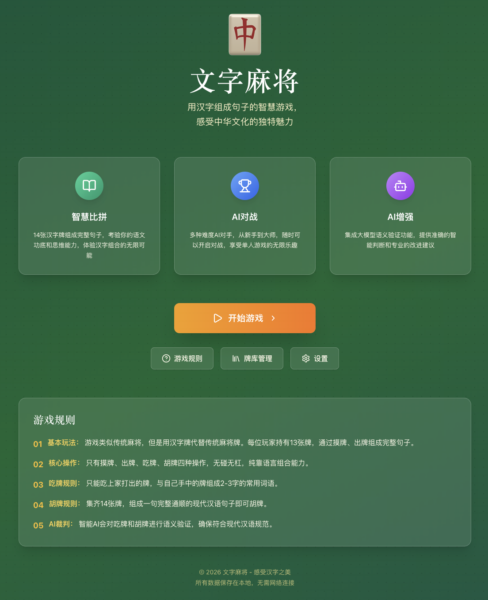

# Word Mahjong

A single-player mahjong game based on Chinese character combination, combining traditional mahjong gameplay with Chinese character culture. Win the game by combining characters to form complete sentences.



[中文版本](./README.zh-CN.md)

## ✨ Features

- 🀄 **Innovative Gameplay**: Combining traditional mahjong rules with Chinese sentence formation, offering a brand new gaming experience
- 🤖 **Smart AI Opponents**: Support 1-3 AI opponents with multiple difficulty levels
- 🧠 **AI Referee System**: Intelligent semantic verification automatically judges the validity of "Chi" (take) and "Hu" (win)
- 🎨 **Exquisite Interface**: Oriental aesthetic design with realistic mahjong tile texture, smooth animations, and comfortable gaming experience
- 💾 **Local Storage**: All data saved locally in the browser, no server required, supports offline play
- 🔧 **Highly Customizable**: Support custom card libraries, game rules, AI settings, and more
- 🤝 **AI Enhancement**: Optional integration with LLM APIs (Doubao, OpenAI, Claude, Gemini, etc.) for more accurate semantic verification
- 📚 **Card Library Management**: Complete card library management system supporting import/export and CRUD operations

## 🎮 Game Rules

### Basic Rules
- The game consists of 1 human player and 1-3 AI opponents
- Card library contains 148 high-frequency simplified Chinese characters used in daily life
- Game flow: Draw tile → Form combinations → Discard tile → "Chi"/"Hu" judgment
- Winning condition: Form a complete and grammatically correct modern Chinese sentence with 14 tiles

### Core Operations
- **Draw**: Draw a tile from the wall each turn
- **Discard**: Play an unwanted tile from your hand
- **Chi**: The next player can take the tile discarded by the previous player to form a valid word with their hand tiles
- **Hu**: Win the game when your hand can form a complete and coherent sentence

### Unique Mechanics
- No "Peng" or "Gang" operations, focusing on the core gameplay of Chinese character combination
- AI referee automatically verifies semantic validity
- Support appeal function, users can explain the meaning of words
- Automatic punctuation addition when winning, improving sentence readability
- Adjustable semantic verification strictness

## 🚀 Quick Start

### Environment Requirements
- Node.js >= 18.x
- Modern browser (Chrome, Firefox, Safari, Edge, etc.)

### Install Dependencies
```bash
npm install
# or using pnpm
pnpm install
```

### Start Development Server
```bash
npm run dev
# or
pnpm dev
```

Visit http://localhost:5173 to start playing.

### Build Production Version
```bash
npm run build
# or
pnpm build
```

Build output will be in the `dist` directory, which can be deployed to any static website hosting service.

### Preview Production Version
```bash
npm run preview
# or
pnpm preview
```

### AI Enhancement Configuration (Optional)
To use AI enhancement features, you need to configure LLM API keys:

1. Copy the environment variable template file:
```bash
cp env.template .env
```

2. Edit the `.env` file and replace `YOUR_KEY_HERE` with your actual Doubao API key:
```env
VITE_DOUBao_API_KEY=your_actual_api_key_here
```

3. Restart the development server to enable AI enhancement features.

## 📁 Project Structure

```
WordMahjong/
├── src/
│   ├── components/          # Common components
│   │   ├── GameTable.tsx    # Game table component
│   │   ├── MahjongTile.tsx  # Mahjong tile component
│   │   ├── PlayerHand.tsx   # Player hand component
│   │   └── LogViewer.tsx    # Log viewer
│   ├── pages/               # Page components
│   │   ├── HomePage.tsx     # Home page
│   │   ├── GameSettings.tsx # Game settings page
│   │   ├── LibraryPage.tsx  # Card library management page
│   │   └── HelpPage.tsx     # Help page
│   ├── hooks/               # React Hooks
│   │   └── useGameStore.ts  # Game state management
│   ├── services/            # Core services
│   │   ├── AIService.ts     # AI opponent engine
│   │   └── CardLibrary.ts   # Card library manager
│   ├── utils/               # Utility functions
│   │   ├── storage.ts       # Local storage utilities
│   │   └── validation.ts    # Semantic validation tools
│   ├── types/               # Type definitions
│   ├── App.tsx              # Root component
│   └── main.tsx             # Application entry
├── public/
│   └── assets/cards/        # Mahjong tile SVG resources
├── documents/               # Project documentation
│   ├── 产品需求文档.md
│   ├── 技术架构文档.md
│   ├── 游戏核心逻辑模块设计方案.md
│   ├── AI对手设计方案.md
│   └── 牌库设计方案.md
├── package.json
├── vite.config.ts
├── tailwind.config.js
└── tsconfig.json
```

## 🛠️ Tech Stack

- **Frontend Framework**: React 19 + TypeScript
- **Build Tool**: Vite
- **Styling**: Tailwind CSS 3
- **State Management**: Zustand
- **Icon Library**: Lucide React
- **Drag and Drop**: @dnd-kit
- **Toast Component**: Sonner
- **Testing Framework**: Vitest
- **Data Storage**: Browser LocalStorage

## 🎯 Core Features

### Game System
- ✅ Complete mahjong game flow control
- ✅ 1-3 AI opponents
- ✅ Intelligent AI decision system
- ✅ Semantic validation engine
- ✅ Automatic punctuation addition
- ✅ Auto-save game state

### Card Library System
- ✅ 148 high-frequency Chinese characters
- ✅ 7 part-of-speech categories with balanced semantic design
- ✅ Support custom card libraries
- ✅ Card library import/export functionality
- ✅ Character and category management
- ✅ Card library management page

### AI Enhancement (Optional)
- 🔧 Support ByteDance Doubao LLM integration
- 🔧 More accurate semantic verification
- 🔧 Smarter AI opponents
- 🔧 API keys configured via environment variables, privacy-safe
- 🔧 Automatic fallback mechanism, uses local validation when network is poor

## 🧪 Development

### Run Tests
```bash
# Run all tests
npm run test

# Launch UI test interface
npm run test:ui

# Generate coverage report
npm run test:coverage
```

### Code Linting
```bash
npm run lint
```

## 📖 Game Guide

### Card Library Design
The card library has 148 tiles divided into 7 categories:
- Core Emotion Words (11 tiles): I, you, love, home, heart, etc.
- High-frequency Verbs (32 tiles): eat, drink, play, joy, walk, run, etc.
- Daily Nouns (40 tiles): rice, water, tea, food, home, book, etc.
- Adjectives (20 tiles): good, beautiful, fragrant, sweet, fast, slow, etc.
- Adverbs + Function Words + Modal Particles (19 tiles): of, le, zhe, very, too, ah, etc.
- Scene/Direction Words (21 tiles): up, down, left, right, east, south, west, north, etc.
- Supplementary Fusion Words (8 tiles): one, two, three, no, is, etc.

### Game Tips
1. **Prioritize core characters**: Personal pronouns, core verbs, structural particles are the foundation of sentence construction
2. **Pay attention to part-of-speech collocation**: Reasonable collocation of nouns, verbs, and adjectives
3. **Use "Chi" flexibly**: Quickly form words by taking discarded tiles
4. **Plan sentence structure**: Conceive the sentence structure you want to form in advance, keep relevant tiles accordingly
5. **Try different combinations**: The same tiles can form multiple different sentences

## 🤝 Contributing

Issues and Pull Requests are welcome to improve this project!

### Development Standards
- Use TypeScript for type safety
- Follow React Hooks best practices
- Keep components single-responsibility, under 300 lines
- Use Tailwind CSS for styling
- Ensure lint and tests pass before committing code

## 📄 License

MIT License

## 🙏 Acknowledgments

Thanks to all who contribute to Chinese cultural dissemination, helping more people experience the charm of Chinese characters!

---

**Enjoy the fun of Chinese character combination, experience the innovative gameplay of traditional culture!** 🎉