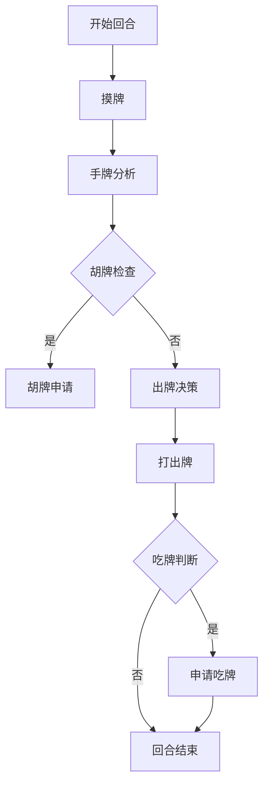

# 中文文字麻将 - AI对手设计方案

## 1. 引言

本方案旨在设计一个智能的AI对手，能够在中文文字麻将游戏中与玩家进行交互，提供不同难度级别的挑战。AI对手需要具备牌型分析、语义理解、造句策略、出牌决策等核心能力，以实现与人类玩家的自然交互和竞技体验。

## 2. 核心行为逻辑

### 2.1 AI对手角色定位

AI对手作为游戏的核心交互对象，需要具备以下行为特征：
- 模拟真实玩家的思维过程
- 具备牌型分析和语义理解能力
- 能够根据难度级别调整策略
- 提供多样化的出牌和吃牌决策
- 具备胡牌判定和优化能力

### 2.2 基础行为流程

AI对手的单回合行为流程如下：



## 3. 不同难度级别的策略差异

### 3.1 难度级别定义

AI对手分为四个难度级别，每个级别对应不同的策略复杂度和决策质量：

| 难度级别 | 策略特点 | 决策速度 | 语义理解能力 | 造句质量 |
|----------|----------|----------|--------------|----------|
| 简单（Easy） | 基础策略，优先保留核心字，简单造句 | 快 | 低 | 一般 |
| 普通（Normal） | 平衡策略，兼顾效率和质量 | 中 | 中 | 良好 |
| 困难（Hard） | 高级策略，深度分析，优化造句 | 慢 | 高 | 优秀 |
| 专家（Expert） | 专家策略，全面评估，最优决策 | 较慢 | 极高 | 卓越 |

### 3.2 策略差异实现

#### 3.2.1 简单难度（Easy）
- **牌型分析**：仅分析基础牌型，优先保留核心字（我、你、的、了、吃、去等）
- **语义理解**：使用简单的句式模板，如「谁+做什么」
- **出牌策略**：优先打出不常用字，避免复杂组合
- **吃牌策略**：仅吃简单的词语组合（如「吃饭」、「开心」等）
- **胡牌策略**：仅尝试基础句式的胡牌

#### 3.2.2 普通难度（Normal）
- **牌型分析**：分析牌型组合，评估字的搭配价值
- **语义理解**：使用完整的主谓宾句式，如「谁+在什么地方+做什么」
- **出牌策略**：评估字的使用价值，优先打出搭配难度高的字
- **吃牌策略**：吃牌时考虑对整体造句的影响
- **胡牌策略**：尝试优化句式，提高通顺度

#### 3.2.3 困难难度（Hard）
- **牌型分析**：深度分析牌型组合，评估字的多种搭配可能性
- **语义理解**：使用复杂句式，添加修饰词和状语
- **出牌策略**：综合评估字的使用价值和对对手的影响
- **吃牌策略**：吃牌前评估对整体造句的影响，优先补充核心关键词
- **胡牌策略**：全面优化句式，提高语义清晰度和生动性

#### 3.2.4 专家难度（Expert）
- **牌型分析**：全面评估牌型组合，考虑所有可能的造句路径
- **语义理解**：使用高级句式，添加修辞手法和情感表达
- **出牌策略**：综合评估字的使用价值、对对手的影响和防守策略
- **吃牌策略**：吃牌时考虑对整体造句的影响和对手的可能反应
- **胡牌策略**：追求完美句式，提高句子的生动性和艺术性

## 4. 牌型分析算法

### 4.1 字库分类模型

AI对手需要对牌库中的144个汉字进行分类，以便更好地分析和组合。根据规则，字库分为以下7类：

1. **情感核心字**：我、你、爱、家、心（2张/字）
2. **高频动词**：吃、喝、玩、乐、走、跑、看、听、说、读、写、做、打、开、关、拿、放、想、念、买、卖、学、睡、飞、洗（其中吃、说、想为2张/字，其余为1张/字）
3. **日常名词**：饭、面、水、茶、酒、菜、肉、蛋、米、车、船、机、路、门、窗、床、桌、椅、灯、书、笔、纸、钱、包、衣、鞋、猫、狗、花、草、树、山、海、天、日、月、风、云（1张/字）
4. **形容词**：好、美、香、甜、快、慢、大、小、多、少、新、旧、暖、冷、喜、乐、安、康、顺、旺（1张/字）
5. **副词 + 虚词 + 语气词**：的、地、得、了、着、过、很、太、真、就、也、都、啊、呀、吧（其中的、了、也、就为2张/字，其余为1张/字）
6. **场景 / 方位字**：校、店、园、厨、厅、房、里、外、上、下、左、右、前、后、东、南、西、北、家（1张/字）
7. **补充融合字**：一、二、三、不、是（其中一、不、是为2张/字，其余为1张/字）

### 4.2 牌型分析算法实现

```javascript
// 字库分类数据
const charCategories = {
  emotion: ['我', '你', '爱', '家', '心'],
  verb: ['吃', '喝', '玩', '乐', '走', '跑', '看', '听', '说', '读', '写', '做', '打', '开', '关', '拿', '放', '想', '念', '买', '卖', '学', '睡', '飞', '洗'],
  noun: ['饭', '面', '水', '茶', '酒', '菜', '肉', '蛋', '米', '车', '船', '机', '路', '门', '窗', '床', '桌', '椅', '灯', '书', '笔', '纸', '钱', '包', '衣', '鞋', '猫', '狗', '花', '草', '树', '山', '海', '天', '日', '月', '风', '云'],
  adjective: ['好', '美', '香', '甜', '快', '慢', '大', '小', '多', '少', '新', '旧', '暖', '冷', '喜', '乐', '安', '康', '顺', '旺'],
  adverb: ['的', '地', '得', '了', '着', '过', '很', '太', '真', '就', '也', '都', '啊', '呀', '吧'],
  location: ['校', '店', '园', '厨', '厅', '房', '里', '外', '上', '下', '左', '右', '前', '后', '东', '南', '西', '北', '家'],
  complement: ['一', '二', '三', '不', '是']
};

// 牌型分析函数
function analyzeHandCards(handCards, difficulty) {
  const analysisResult = {
    categoryCount: {},
    coreWords: [],
    highValueWords: [],
    lowValueWords: [],
    possiblePhrases: []
  };

  // 计算各类别字的数量
  Object.keys(charCategories).forEach(category => {
    analysisResult.categoryCount[category] = 0;
  });

  handCards.forEach(card => {
    for (const [category, chars] of Object.entries(charCategories)) {
      if (chars.includes(card)) {
        analysisResult.categoryCount[category]++;
        break;
      }
    }
  });

  // 识别核心字和高价值字
  const coreCharCategories = ['emotion', 'adverb', 'verb'];
  handCards.forEach(card => {
    if (coreCharCategories.some(category => charCategories[category].includes(card))) {
      analysisResult.coreWords.push(card);
    }
  });

  // 识别低价值字
  const lowValueChars = ['二', '三'];
  handCards.forEach(card => {
    if (lowValueChars.includes(card)) {
      analysisResult.lowValueWords.push(card);
    }
  });

  // 生成可能的短语组合
  analysisResult.possiblePhrases = generatePossiblePhrases(handCards, difficulty);

  return analysisResult;
}
```

## 5. 语义理解和造句策略

### 5.1 语义理解模型

AI对手的语义理解基于预定义的句式模板和自然语言处理技术。通过分析手牌的字种和数量，AI对手会尝试生成符合语法规范的句子。

### 5.2 造句策略

#### 5.2.1 基础句式模板

AI对手使用以下基础句式模板：
1. **谁 + 做什么**（简单句）：如「我吃饭」
2. **谁 + 在什么地方 + 做什么**（完整句）：如「我在家吃饭」
3. **谁 + 和谁 + 在什么地方 + 做什么**（复杂句）：如「我和你在家吃饭」

#### 5.2.2 造句策略实现

```javascript
// 基础句式模板
const sentenceTemplates = [
  // 简单句
  { template: '{emotion} {verb} {noun}', score: 1 },
  { template: '{emotion} {location} {verb}', score: 1.2 },
  { template: '{emotion} {verb} {adjective}', score: 0.9 },
  
  // 完整句
  { template: '{emotion} 在 {location} {verb} {noun}', score: 2.5 },
  { template: '{emotion} 和 {emotion} 在 {location} {verb} {noun}', score: 3.5 },
  { template: '{emotion} {adverb} {adjective} {verb} {noun}', score: 2.8 },
  
  // 复杂句
  { template: '{emotion} 在 {location} {verb} 很 {adjective} 的 {noun}', score: 4.2 },
  { template: '{emotion} 和 {emotion} 今天在 {location} {verb} {adjective} 的 {noun}', score: 5.0 }
];

// 造句策略函数
function generateSentenceOptions(handCards, analysisResult, difficulty) {
  const sentenceOptions = [];
  
  // 遍历句式模板
  sentenceTemplates.forEach(template => {
    // 尝试匹配模板中的变量
    const matchedSentence = matchTemplate(template.template, handCards, analysisResult, difficulty);
    if (matchedSentence) {
      sentenceOptions.push({
        sentence: matchedSentence,
        score: calculateSentenceScore(matchedSentence, difficulty),
        template: template.template
      });
    }
  });
  
  // 根据难度级别筛选和排序句子选项
  return sortAndFilterSentences(sentenceOptions, difficulty);
}

// 匹配句式模板函数
function matchTemplate(template, handCards, analysisResult, difficulty) {
  // 这里是简化的匹配逻辑，实际实现会更复杂
  // 替换模板中的变量为实际的字
  let matchedSentence = template;
  
  // 替换情感核心字
  if (matchedSentence.includes('{emotion}')) {
    const emotionChars = handCards.filter(card => charCategories.emotion.includes(card));
    if (emotionChars.length > 0) {
      matchedSentence = matchedSentence.replace('{emotion}', emotionChars[0]);
    } else {
      return null;
    }
  }
  
  // 替换动词
  if (matchedSentence.includes('{verb}')) {
    const verbChars = handCards.filter(card => charCategories.verb.includes(card));
    if (verbChars.length > 0) {
      matchedSentence = matchedSentence.replace('{verb}', verbChars[0]);
    } else {
      return null;
    }
  }
  
  // 替换名词
  if (matchedSentence.includes('{noun}')) {
    const nounChars = handCards.filter(card => charCategories.noun.includes(card));
    if (nounChars.length > 0) {
      matchedSentence = matchedSentence.replace('{noun}', nounChars[0]);
    } else {
      return null;
    }
  }
  
  // 替换形容词
  if (matchedSentence.includes('{adjective}')) {
    const adjChars = handCards.filter(card => charCategories.adjective.includes(card));
    if (adjChars.length > 0) {
      matchedSentence = matchedSentence.replace('{adjective}', adjChars[0]);
    } else {
      return null;
    }
  }
  
  // 替换副词
  if (matchedSentence.includes('{adverb}')) {
    const adverbChars = handCards.filter(card => charCategories.adverb.includes(card));
    if (adverbChars.length > 0) {
      matchedSentence = matchedSentence.replace('{adverb}', adverbChars[0]);
    } else {
      return null;
    }
  }
  
  // 替换方位词
  if (matchedSentence.includes('{location}')) {
    const locationChars = handCards.filter(card => charCategories.location.includes(card));
    if (locationChars.length > 0) {
      matchedSentence = matchedSentence.replace('{location}', locationChars[0]);
    } else {
      return null;
    }
  }
  
  // 检查句子是否使用了所有必须的字
  if (difficulty === 'hard' || difficulty === 'expert') {
    const usedChars = new Set(matchedSentence.split(''));
    const requiredChars = handCards.filter(card => !charCategories.adverb.includes(card));
    const unusedRequiredChars = requiredChars.filter(card => !usedChars.has(card));
    
    if (unusedRequiredChars.length > 0) {
      return null;
    }
  }
  
  return matchedSentence;
}

// 句子评分函数
function calculateSentenceScore(sentence, difficulty) {
  let score = 0;
  
  // 基础分数
  score += sentence.length;
  
  // 语义完整性加分
  if (sentence.includes('的') || sentence.includes('了')) {
    score += 5;
  }
  
  // 情感表达加分
  if (sentence.includes('爱') || sentence.includes('心')) {
    score += 3;
  }
  
  // 难度级别加分
  if (difficulty === 'hard') {
    score *= 1.2;
  } else if (difficulty === 'expert') {
    score *= 1.5;
  }
  
  return score;
}

// 句子选项筛选和排序函数
function sortAndFilterSentences(sentenceOptions, difficulty) {
  // 根据难度级别筛选句子选项
  let filteredSentences = sentenceOptions;
  
  if (difficulty === 'easy') {
    filteredSentences = sentenceOptions.filter(option => option.sentence.length <= 6);
  } else if (difficulty === 'normal') {
    filteredSentences = sentenceOptions.filter(option => option.sentence.length <= 8);
  }
  
  // 排序句子选项
  return filteredSentences.sort((a, b) => b.score - a.score);
}
```

## 6. 出牌、吃牌、胡牌决策算法

### 6.1 出牌决策算法

AI对手的出牌决策基于以下几个因素：
1. 字的使用价值
2. 对整体造句的影响
3. 对对手的潜在威胁
4. 难度级别的策略

```javascript
// 出牌决策函数
function decideToDiscardCard(handCards, analysisResult, difficulty) {
  const discardCandidates = [];
  
  // 遍历手牌，计算每张牌的丢弃价值
  handCards.forEach(card => {
    const discardValue = calculateDiscardValue(card, handCards, analysisResult, difficulty);
    discardCandidates.push({
      card,
      value: discardValue
    });
  });
  
  // 按照丢弃价值排序
  discardCandidates.sort((a, b) => a.value - b.value);
  
  // 难度级别特定的调整
  if (difficulty === 'easy') {
    // 简单难度优先丢弃低价值字
    const lowValueCandidates = discardCandidates.filter(candidate => analysisResult.lowValueWords.includes(candidate.card));
    if (lowValueCandidates.length > 0) {
      return lowValueCandidates[0].card;
    }
  } else if (difficulty === 'hard' || difficulty === 'expert') {
    // 困难和专家难度会综合考虑更多因素
    return discardCandidates[0].card;
  }
  
  // 默认返回丢弃价值最低的牌
  return discardCandidates[0].card;
}

// 计算丢弃价值函数
function calculateDiscardValue(card, handCards, analysisResult, difficulty) {
  let value = 0;
  
  // 核心字的丢弃价值高
  if (analysisResult.coreWords.includes(card)) {
    value += 10;
  }
  
  // 高价值字的丢弃价值较高
  if (analysisResult.highValueWords.includes(card)) {
    value += 5;
  }
  
  // 低价值字的丢弃价值较低
  if (analysisResult.lowValueWords.includes(card)) {
    value -= 5;
  }
  
  // 检查该字是否是可能短语的组成部分
  const isInPhrase = analysisResult.possiblePhrases.some(phrase => phrase.includes(card));
  if (isInPhrase) {
    value += 3;
  }
  
  // 计算该字在所有可能句子中的使用频率
  const sentenceCount = countCardInSentences(card, handCards, analysisResult, difficulty);
  value += sentenceCount * 2;
  
  return value;
}
```

### 6.2 吃牌决策算法

AI对手的吃牌决策基于以下几个因素：
1. 组成的词语是否符合规范
2. 对整体造句的影响
3. 吃牌后是否会破坏后续造句的可能性
4. 难度级别的策略

```javascript
// 吃牌决策函数
function decideToEatCard(discardedCard, handCards, analysisResult, difficulty) {
  // 检查是否符合吃牌条件
  const possibleCombinations = findValidCombinations(discardedCard, handCards);
  
  if (possibleCombinations.length === 0) {
    return null;
  }
  
  // 评估每种可能的组合
  const evaluatedCombinations = possibleCombinations.map(combination => {
    const combinationScore = evaluateCombination(combination, handCards, analysisResult, difficulty);
    return {
      combination,
      score: combinationScore
    };
  });
  
  // 排序评估结果
  evaluatedCombinations.sort((a, b) => b.score - a.score);
  
  // 根据难度级别选择是否吃牌
  if (difficulty === 'easy') {
    // 简单难度只要符合条件就会吃牌
    return evaluatedCombinations[0].combination;
  } else if (difficulty === 'normal') {
    // 普通难度要求组合得分达到一定阈值
    if (evaluatedCombinations[0].score >= 5) {
      return evaluatedCombinations[0].combination;
    }
  } else if (difficulty === 'hard' || difficulty === 'expert') {
    // 困难和专家难度要求更高的得分
    if (evaluatedCombinations[0].score >= 8) {
      return evaluatedCombinations[0].combination;
    }
  }
  
  // 默认不吃牌
  return null;
}

// 查找有效的吃牌组合
function findValidCombinations(discardedCard, handCards) {
  const validCombinations = [];
  
  // 尝试组合不同数量的手牌
  for (let i = 1; i <= handCards.length; i++) {
    const combinations = getCombinations(handCards, i);
    
    combinations.forEach(combination => {
      const fullCombination = [discardedCard, ...combination];
      if (isValidWordPhrase(fullCombination)) {
        validCombinations.push(fullCombination);
      }
    });
  }
  
  return validCombinations;
}

// 验证词语组合的有效性
function isValidWordPhrase(combination) {
  // 简单的词语验证逻辑
  const validPhrases = [
    '吃饭', '开心', '在家', '我家', '你的', '好的', '美丽', '快乐', '学习', '看书',
    '跑步', '走路', '喝水', '喝茶', '喝酒', '吃肉', '睡觉', '开车', '开门', '关门',
    '读书', '写字', '做什么', '去哪里', '看什么', '听什么', '很开心', '很高兴', '很好',
    '很快乐', '在家吃饭', '我在家', '你在家', '我们家', '你的家', '美丽的', '快乐的',
    '学习的', '看书的', '跑步的', '走路的', '喝水的', '喝茶的', '喝酒的', '吃肉的',
    '睡觉的', '开车的', '开门的', '关门的', '读书的', '写字的'
  ];
  
  const combinationStr = combination.join('');
  return validPhrases.some(phrase => phrase.includes(combinationStr) || combinationStr.includes(phrase));
}

// 评估吃牌组合的价值
function evaluateCombination(combination, handCards, analysisResult, difficulty) {
  let score = 0;
  
  // 组合长度加分
  score += combination.length;
  
  // 核心字加分
  const coreWordCount = combination.filter(card => analysisResult.coreWords.includes(card)).length;
  score += coreWordCount * 3;
  
  // 组成词语的常用度加分
  if (combination.length === 2) {
    score += 5;
  } else if (combination.length === 3) {
    score += 8;
  } else if (combination.length > 3) {
    score += 10;
  }
  
  // 难度级别加分
  if (difficulty === 'hard') {
    score *= 1.2;
  } else if (difficulty === 'expert') {
    score *= 1.5;
  }
  
  return score;
}

// 获取组合的辅助函数
function getCombinations(arr, k) {
  if (k === 0) return [[]];
  if (arr.length === 0) return [];
  
  const head = arr[0];
  const tail = arr.slice(1);
  
  const combinationsWithHead = getCombinations(tail, k - 1).map(comb => [head, ...comb]);
  const combinationsWithoutHead = getCombinations(tail, k);
  
  return [...combinationsWithHead, ...combinationsWithoutHead];
}
```

### 6.3 胡牌决策算法

AI对手的胡牌决策基于以下几个因素：
1. 手牌是否符合胡牌条件
2. 句子的语义通顺度
3. 难度级别的策略

```javascript
// 胡牌决策函数
function decideToWin(handCards, analysisResult, difficulty) {
  // 检查手牌数量是否符合胡牌条件
  if (handCards.length !== 14 && !analysisResult.eatenCards) {
    return null;
  }
  
  if (analysisResult.eatenCards) {
    const totalCards = handCards.length + analysisResult.eatenCards.flat().length;
    if (totalCards !== 14) {
      return null;
    }
  }
  
  // 生成可能的胡牌句子
  const winSentenceOptions = generateWinSentenceOptions(handCards, analysisResult, difficulty);
  
  // 选择最佳的胡牌句子
  if (winSentenceOptions.length > 0) {
    return winSentenceOptions[0];
  }
  
  return null;
}

// 生成胡牌句子选项函数
function generateWinSentenceOptions(handCards, analysisResult, difficulty) {
  const winSentenceOptions = [];
  
  // 基础句子生成
  const sentenceOptions = generateSentenceOptions(handCards, analysisResult, difficulty);
  
  // 检查是否符合胡牌条件
  sentenceOptions.forEach(option => {
    if (isValidWinSentence(option.sentence, handCards, analysisResult)) {
      winSentenceOptions.push({
        sentence: option.sentence,
        score: option.score,
        template: option.template
      });
    }
  });
  
  return winSentenceOptions;
}

// 验证胡牌句子的有效性
function isValidWinSentence(sentence, handCards, analysisResult) {
  // 检查句子是否使用了所有牌
  const sentenceChars = sentence.split('');
  const allCards = analysisResult.eatenCards ? [...handCards, ...analysisResult.eatenCards.flat()] : handCards;
  
  // 计数句子中每个字的使用次数
  const charCountInSentence = {};
  sentenceChars.forEach(char => {
    charCountInSentence[char] = (charCountInSentence[char] || 0) + 1;
  });
  
  // 计数手牌中每个字的使用次数
  const charCountInCards = {};
  allCards.forEach(card => {
    charCountInCards[card] = (charCountInCards[card] || 0) + 1;
  });
  
  // 检查是否所有牌都被使用
  for (const [char, count] of Object.entries(charCountInCards)) {
    if (!charCountInSentence[char] || charCountInSentence[char] < count) {
      return false;
    }
  }
  
  // 检查句子是否符合语法规范
  return isValidSentence(sentence);
}

// 验证句子语法的辅助函数
function isValidSentence(sentence) {
  // 简单的语法验证
  const validSentencePatterns = [
    /^.*[。！？]?$/, // 以标点结尾或没有标点
    /^[我你他她它]/.test(sentence), // 以人称开头
    /[了的]/.test(sentence) // 包含常用虚词
  ];
  
  return validSentencePatterns.every(pattern => pattern);
}
```

## 7. 实现细节和优化方案

### 7.1 性能优化

为了提高AI对手的决策速度，我们采用以下优化方案：

1. **预计算优化**：在游戏初始化阶段预计算常用短语和句子模板
2. **缓存机制**：缓存分析结果和句子选项，避免重复计算
3. **剪枝策略**：在高难度级别限制搜索深度，减少计算量
4. **并行计算**：将复杂任务分解为多个子任务并行处理

### 7.2 代码架构设计

AI对手的代码架构分为以下几个模块：
1. **牌型分析模块**：负责手牌的分类和分析
2. **语义理解模块**：负责句子生成和语义分析
3. **决策模块**：负责出牌、吃牌、胡牌的决策
4. **策略模块**：负责不同难度级别的策略实现
5. **优化模块**：负责性能优化和算法优化

### 7.3 测试和调试方案

为了确保AI对手的正确性和稳定性，我们采用以下测试和调试方案：

1. **单元测试**：对每个核心功能进行单元测试
2. **集成测试**：对AI对手的整体行为进行测试
3. **性能测试**：对AI对手的决策速度进行测试
4. **模拟游戏测试**：通过模拟游戏场景测试AI对手的行为
5. **可视化调试**：提供决策过程的可视化，帮助调试和优化

## 8. 总结

本方案详细设计了中文文字麻将游戏的AI对手，包括核心行为逻辑、不同难度级别的策略差异、牌型分析算法、语义理解和造句策略、出牌、吃牌、胡牌决策算法等。通过使用预定义的句式模板和自然语言处理技术，AI对手能够与人类玩家进行自然的交互，并提供不同难度级别的挑战。

同时，我们还设计了性能优化方案和测试调试方案，以确保AI对手的正确性和稳定性。未来的改进方向包括：
1. 引入更高级的自然语言处理技术
2. 增加AI对手的学习能力
3. 优化决策算法的效率
4. 提供更多的策略和玩法
