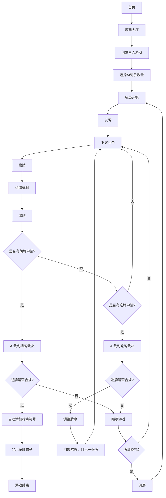
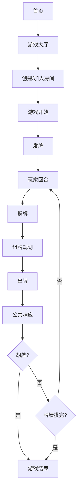
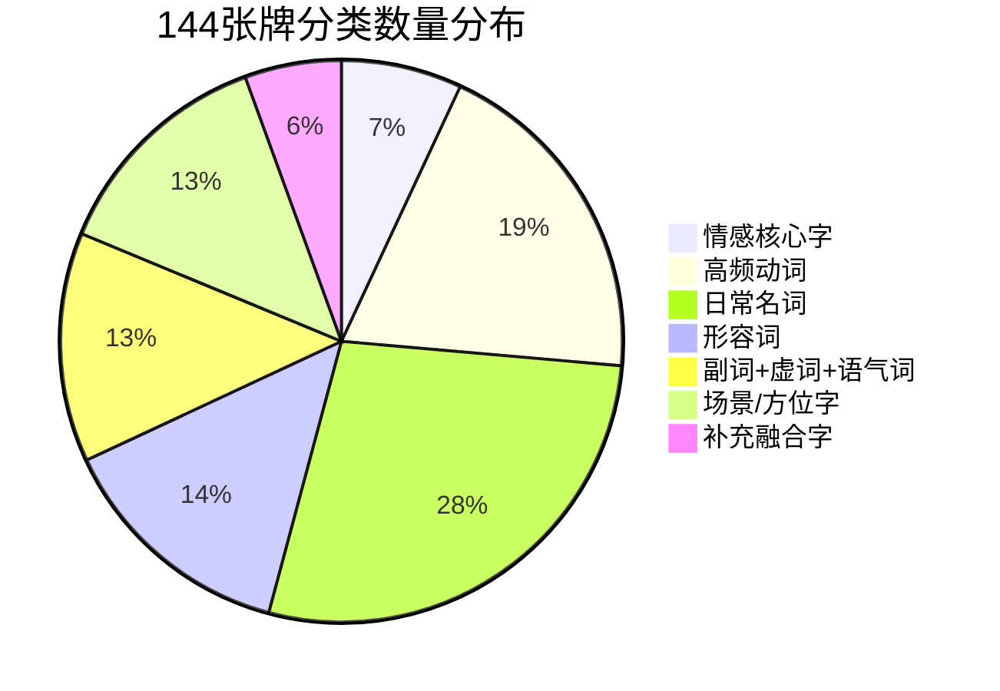

## 1. 产品概述
本产品是一款基于汉字麻将规则的**单机游戏应用**，由1名玩家与1-3名AI对手组成，旨在通过汉字组合造句的方式提供娱乐体验。游戏全程无碰无杠，仅保留摸牌、出牌、吃牌、胡牌四种核心操作，玩家需使用14张牌连成一句完整合规的现代汉语句子来获胜。产品目标用户为全年龄段汉字使用者，提供简单易懂的游戏规则和丰富的趣味玩法，适合家庭聚会、朋友娱乐等场景。

### 1.1 技术架构
产品采用**纯前端单机架构**，所有游戏逻辑和数据都在浏览器中运行，无需服务器和网络连接。使用React + TypeScript构建，数据存储使用浏览器LocalStorage。

#### 1.1.1 前端技术栈
- **框架**：React 18 + TypeScript
- **构建工具**：Vite
- **样式**：Tailwind CSS 3
- **状态管理**：Zustand
- **图标库**：lucide-react
- **样式工具**：clsx + tailwind-merge
- **动画**：canvas-confetti
- **数据存储**：LocalStorage

#### 1.1.2 部署建议
- **打包**：使用Vite构建为静态HTML/CSS/JS文件
- **分发**：可以直接在浏览器中打开本地文件运行，或部署到任何静态网站托管服务
- **使用方式**：无需网络连接，下载后即可离线使用

## 2. 核心 Features

### 2.1 用户 Roles
| 角色 | 类型 | 核心职责 |
|------|------|----------|
| 玩家 | 人类用户 | 参与游戏，通过汉字组合造句获胜 |
| AI对手 | 计算机程序 | 模拟人类玩家行为，与玩家进行游戏 |
| AI裁判 | 系统功能 | 负责判定吃牌申请的有效性、胡牌条件的合规性，以及调整牌序、添加标点符号等 |

### 2.2 AI裁判核心功能
AI裁判负责裁决玩家的吃牌和胡牌操作，确保游戏的语义合规性：

#### 2.2.1 吃牌裁决
- 判断吃牌申请是否符合现代汉语语义规范
- 检查能否组成合规词语、固定搭配或常用短语
- 评估词组合理性，检查是否符合常见语义模式
- 提供吃牌建议和改进方向

#### 2.2.2 胡牌裁决  
- 检查胡牌的硬性前提（牌数是否为14张）
- 验证句子的语义完整性和合规性
- 评估句子的通顺度、语义清晰度和语法正确性
- 提供语义评分和改进建议

#### 2.2.3 语义验证机制
- 使用预定义的词汇和句式规则进行基础验证
- 支持用户调整词序和添加标点符号以提高语义正确性
- 提供详细的验证结果和优化建议
- 允许用户选择验证严格程度

#### 2.2.4 交互功能
- 在胡牌时弹出语义验证对话框
- 支持用户在句子中任意添加标点符号
- 提供语义评分和改进建议
- 允许用户重新调整词序或添加标点符号

### 2.2 Feature Module
产品包含以下主要页面：
1. **首页**：游戏介绍、规则说明、开始游戏按钮、设置入口
2. **游戏设置页**：AI对手数量选择（1-3名）、AI难度设置、牌库选择
3. **游戏界面**：牌桌展示、手牌管理、吃牌/胡牌操作、游戏流程控制、AI裁判裁决展示
4. **设置页面**：音效开关、动画调整、规则说明、字库自定义选项
5. **牌库管理页面**：牌库编辑、分类管理、单字管理、重复牌设置、导出/导入功能
6. **AI设置页面**：大模型API配置、AI增强功能开关、隐私设置

### 2.3 页面 Details

| Page Name | Module Name | Feature description |
|-----------|-------------|---------------------|
| 首页 | 游戏介绍 | 展示游戏规则、玩法特点、目标受众等信息，吸引用户参与 |
| 首页 | 开始游戏 | 提供单人游戏创建入口，支持快速开始游戏 |
| 游戏大厅 | 房间创建 | 允许用户选择AI对手数量（1-3名），设置游戏规则和字库参数 |
| 游戏大厅 | 房间设置 | 提供游戏规则自定义选项，包括胡牌条件、时间限制等 |
| 游戏界面 | 牌桌展示 | 实时显示牌桌状态、玩家座位、出牌历史等信息，支持东、南、西、北四个方位显示 |
| 游戏界面 | 手牌管理 | 提供手牌的整理、选择、出牌等操作功能，支持拖放操作 |
| 游戏界面 | 吃牌/胡牌 | 实现吃牌和胡牌的操作逻辑，包括条件判断、AI裁判裁决和结果展示 |
| 游戏界面 | 流程控制 | 管理游戏的轮次、摸牌、出牌等核心流程，显示当前轮次和剩余牌数 |
| 游戏界面 | AI裁判展示 | 显示AI裁判的裁决结果，包括吃牌有效性判断和胡牌条件检查 |
| 游戏界面 | 标点符号添加 | 在胡牌时自动为句子添加适当的标点符号，提高可读性 |
| 设置页面 | 基础设置 | 提供音效、画质、语言等基础设置选项 |
| 设置页面 | 规则说明 | 分页展示详细规则，支持搜索和跳转 |
| 设置页面 | 字库自定义 | 允许用户替换、新增汉字，保持总牌数不变的前提下自定义字库 |
| AI设置页面 | API配置 | 支持配置多家大模型服务商的API密钥，本地存储不上传 |
| AI设置页面 | AI增强开关 | 允许用户开启/关闭AI增强语义验证功能 |
| AI设置页面 | 隐私设置 | 提供透明的隐私说明，用户可以随时清除配置 |
| 牌库管理页面 | 牌库编辑 | 提供完整的牌库编辑功能，允许用户自定义牌库内容 |
| 牌库管理页面 | 分类管理 | 管理牌库的分类结构，包括查看分类信息、调整分类顺序等 |
| 牌库管理页面 | 单字管理 | 允许用户添加、删除、修改牌库中的单字，包括汉字、拼音、释义、使用频率等信息 |
| 牌库管理页面 | 重复牌设置 | 允许用户设置重复牌的数量和规则，确保牌库的语义平衡和游戏体验 |
| 牌库管理页面 | 导出/导入功能 | 支持牌库的导出和导入，允许用户分享和备份自定义牌库 |

## 3. 核心 Process

### 用户操作流程

**游戏开始流程**：
1. 玩家通过首页进入游戏大厅
2. 创建单人游戏，选择AI对手数量（1-3名）
3. 系统确定庄家（玩家默认坐东方位）和AI对手的方位（南、西、北）
4. 初始化牌库（144张简体中文生活高频汉字牌）、洗牌、码牌
5. 发牌：庄家起手牌14张，AI对手起手牌13张

**游戏进行流程**：
1. 庄家（玩家）开始回合，按逆时针顺序轮流出牌、摸牌
2. 玩家回合流程：摸牌 → 组牌规划 → 出牌
3. 公共响应：AI裁判判定是否有玩家胡牌或吃牌，按胡牌>吃牌的优先级执行
4. 重复上述流程，直至有玩家胡牌或牌墙摸完流局

**吃牌流程**：
1. 上家打出牌后，下家可申请吃牌
2. AI裁判检查吃牌申请的语义合规性
3. 若吃牌合规，下家将组成词语的牌明放，然后打出一张牌
4. AI裁判调整牌序，确保游戏流程正确

**胡牌流程**：
1. 玩家申请胡牌后，AI裁判检查胡牌条件
2. 检查牌数是否为14张，且全部牌用于造句
3. 判断句子语法是否正确、语义是否完整
4. 自动添加适当的标点符号
5. 显示胡牌结果和获胜句子

## 4. User Interface Design

### 4.1 Design Style
- **整体风格**：简洁现代，以木质纹理和中国风元素相结合，营造温馨舒适的游戏氛围
- **主色调**：深棕色（牌桌）、米白色（背景）、红色（按钮）、绿色（成功提示）、蓝色（AI裁判提示）
- **按钮风格**：圆角矩形，有轻微阴影，点击时有缩放效果
- **字体**：使用清晰易读的无衬线字体，牌面文字使用传统书法字体增加文化氛围
- **布局**：采用对称布局，牌桌居中，操作按钮分布在四周，AI裁判提示信息位于屏幕上方
- **动画效果**：出牌、吃牌、胡牌时有流畅的动画过渡，AI裁判裁决时有特殊的视觉效果，提升游戏体验

### 4.2 Page Design Overview

| Page Name | Module Name | UI Elements |
|-----------|-------------|-------------|
| 首页 | 游戏介绍 | 使用卡片式布局，包含文字和图片，信息层次清晰 |
| 首页 | 开始游戏 | 大尺寸按钮，使用红色高亮，文字醒目 |
| 游戏大厅 | 房间创建 | 表单式布局，包含AI对手数量选择（1-3名）、字库选择等控件 |
| 游戏大厅 | 房间设置 | 下拉框和开关按钮，允许自定义游戏规则 |
| 游戏界面 | 牌桌展示 | 居中的方形牌桌，东、南、西、北四个方位清晰显示，出牌历史滚动显示 |
| 游戏界面 | 手牌管理 | 底部横向排列手牌，支持点击选择和拖拽操作 |
| 游戏界面 | 吃牌/胡牌 | 弹出式提示框，显示操作选项和条件，AI裁判裁决结果高亮显示 |
| 游戏界面 | 流程控制 | 顶部显示轮次、剩余牌数、AI裁判提示等信息 |
| 游戏界面 | 标点符号添加 | 胡牌时显示带标点的句子，标点符号使用蓝色高亮 |
| 设置页面 | 基础设置 | 开关按钮和滑块控件，直观易懂 |
| 设置页面 | 规则说明 | 分页展示详细规则，支持搜索和跳转 |
| 设置页面 | 字库自定义 | 表格形式展示字库内容，支持添加、删除、编辑功能 |
| 牌库管理页面 | 牌库编辑 | 左侧分类导航，右侧牌库内容展示，支持搜索和筛选功能 |
| 牌库管理页面 | 分类管理 | 表格形式展示分类信息，包括分类名称、牌数、占比等，支持编辑和删除功能 |
| 牌库管理页面 | 单字管理 | 表格形式展示单字信息，包括汉字、拼音、释义、使用频率等，支持添加、删除、编辑功能 |
| 牌库管理页面 | 重复牌设置 | 表单式布局，允许用户设置单字的重复次数，支持批量操作 |
| 牌库管理页面 | 导出/导入功能 | 按钮式设计，支持导出为JSON文件和导入JSON文件，显示导入结果和错误信息 |

### 4.3 Responsiveness
产品采用响应式设计，支持桌面端和移动端设备：
- 桌面端优先，提供完整功能和最佳视觉效果
- 移动端自适应屏幕尺寸，简化部分操作按钮
- 支持触摸和鼠标操作，优化手势交互

## 5. 牌库设计细节

### 5.1 牌库设计原则
牌库设计遵循以下核心原则：
- **高频字选择原则**：全部选用现代汉语生活最高频汉字，无生僻字，适配全年龄段玩家
- **语义平衡原则**：合理分配不同词性的汉字数量，确保造句时能够组成完整的句子结构
- **实用性原则**：完整保留预设7大分类框架，总牌数精准控制为144张
- **易扩展性原则**：设计支持自定义字库功能，允许玩家根据需求调整牌库内容

### 5.2 牌库分类和数量统计

#### 分类总览
| 分类序号 | 分类名称 | 分类总牌数 | 占比 |
|---------|---------|-----------|------|
| 1       | 情感核心字 | 10张 | 6.94% |
| 2       | 高频动词 | 28张 | 19.44% |
| 3       | 日常名词 | 40张 | 27.78% |
| 4       | 形容词 | 20张 | 13.89% |
| 5       | 副词+虚词+语气词 | 19张 | 13.19% |
| 6       | 场景/方位字 | 19张 | 13.19% |
| 7       | 补充融合字 | 8张 | 5.56% |
| **总计** | **-** | **144张** | **100%** |

#### 分类数量分布饼图

### 5.3 每个分类的具体牌型

#### 5.3.1 情感核心字（10张）
| 单字 | 数量 | 词性 | 主要用途 |
|------|------|------|----------|
| 我 | 2 | 人称代词 | 主语，表达第一人称 |
| 你 | 2 | 人称代词 | 主语/宾语，表达第二人称 |
| 爱 | 2 | 动词 | 核心情感动词 |
| 家 | 2 | 名词 | 表达家庭概念 |
| 心 | 2 | 名词 | 表达情感或心理活动 |

#### 5.3.2 高频动词（28张）
包含饮食类、娱乐类、移动类、视觉类、听觉类、言语类等动作动词，如：吃、喝、玩、乐、走、跑、看、听、说、读、写、做、打、开、关、拿、放、想、念、买、卖、学、睡、飞、洗等。

#### 5.3.3 日常名词（40张）
包含主食类、饮品类、蔬菜类、肉类、蛋类、交通工具类、道路类、建筑构件类、家具类、照明类、学习用品类、货币类、容器类、衣物类、动物类、植物类、自然景观类等，如：饭、面、水、茶、酒、菜、肉、蛋、米、车、船、机、路、门、窗、床、桌、椅、灯、书、笔、纸、钱、包、衣、鞋、猫、狗、花、草、树、山、海、天、日、月、风、云等。

#### 5.3.4 形容词（20张）
包含正面评价类、感官类、速度类、大小类、数量类、新旧类、温度类、情感类、状态类等，如：好、美、香、甜、快、慢、大、小、多、少、新、旧、暖、冷、喜、乐、安、康、顺、旺等。

#### 5.3.5 副词+虚词+语气词（19张）
包含结构助词、时态助词、程度副词、时间或范围副词、并列或递进副词、感叹语气词、疑问或建议语气词等，如：的、地、得、了、着、过、很、太、真、就、也、都、啊、呀、吧等。

#### 5.3.6 场景/方位字（19张）
包含场景类（学校、商店、公园/花园、厨房、客厅/餐厅、房间）和方位类（里、外、上、下、左、右、前、后、东、南、西、北）等，如：校、店、园、厨、厅、房、里、外、上、下、左、右、前、后、东、南、西、北、家等。

#### 5.3.7 补充融合字（8张）
包含数词和否定副词等，如：一、二、三、不、是等。

### 5.4 重复牌的设计思路

#### 5.4.1 重复牌设计的必要性
在文字麻将中，重复牌的设计有其独特的考虑因素：
1. **造句流畅性**：某些字在句子中出现的频率极高，如“的”、“了”、“是”等，设置重复牌可以增加这些字的获取概率，提高造句的流畅性。
2. **关键结构字保障**：人称代词（如“我”、“你”）、核心动词（如“吃”、“说”、“想”）等是句子的核心骨架，设置重复牌可以确保玩家能够获取到这些关键字。
3. **组合多样性**：重复牌的存在可以增加句子的组合可能性，允许玩家创造更复杂、更丰富的句子。

#### 5.4.2 重复牌设置原则
重复牌的设置遵循以下原则：
1. **高频使用原则**：仅对现代汉语中使用频率最高的字设置重复牌
2. **结构关键原则**：优先考虑对句子结构至关重要的字，如人称代词、结构助词、核心动词等
3. **语义平衡原则**：确保不同词性的重复牌数量相对平衡，避免某一类字过度重复
4. **实用性原则**：重复牌的设置以实际造句需要为依据，避免不必要的重复

#### 5.4.3 重复牌具体设置
根据上述原则，我们对以下字设置了重复牌：
| 字 | 重复次数 | 分类 | 原因说明 |
|----|----------|------|----------|
| 我 | 2 | 情感核心字 | 第一人称代词，使用频率极高 |
| 你 | 2 | 情感核心字 | 第二人称代词，使用频率极高 |
| 爱 | 2 | 情感核心字 | 核心情感动词，使用频率高 |
| 家 | 2 | 情感核心字 | 家庭相关词汇，使用频率高 |
| 心 | 2 | 情感核心字 | 心理活动相关词汇，使用频率高 |
| 吃 | 2 | 高频动词 | 饮食类核心动词，使用频率极高 |
| 说 | 2 | 高频动词 | 言语类核心动词，使用频率极高 |
| 想 | 2 | 高频动词 | 心理活动核心动词，使用频率极高 |
| 的 | 2 | 副词+虚词+语气词 | 结构助词，使用频率最高 |
| 了 | 2 | 副词+虚词+语气词 | 时态助词，使用频率极高 |
| 就 | 2 | 副词+虚词+语气词 | 时间或范围副词，使用频率高 |
| 也 | 2 | 副词+虚词+语气词 | 并列或递进副词，使用频率高 |
| 一 | 2 | 补充融合字 | 数词，使用频率极高 |
| 不 | 2 | 补充融合字 | 否定副词，使用频率极高 |
| 是 | 2 | 补充融合字 | 判断动词，使用频率极高 |
