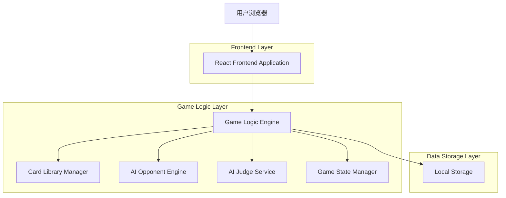
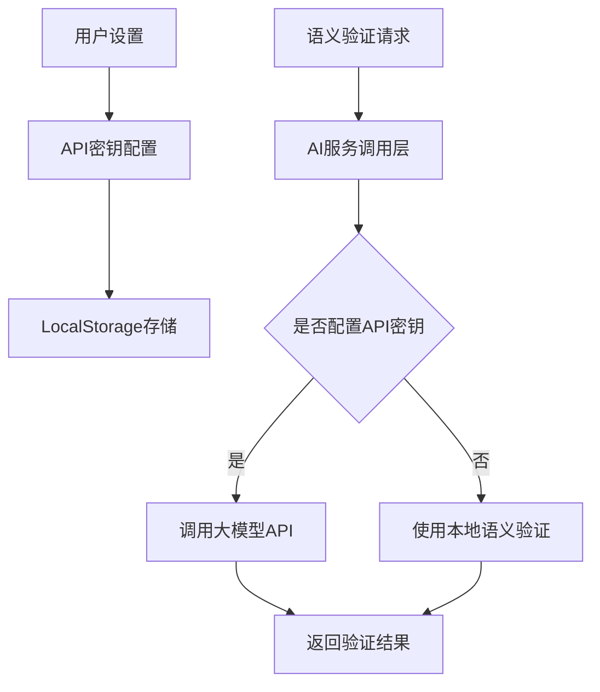

## 1. Architecture Design



## 2. Technology Description

### 前端技术栈
- **框架**: React@18 + TypeScript
- **构建工具**: Vite
- **样式**: Tailwind CSS@3
- **状态管理**: Zustand
- **图标库**: lucide-react
- **样式工具**: clsx + tailwind-merge
- **动画**: canvas-confetti
- **数据存储**: LocalStorage (浏览器存储)
- **序列化**: JSON格式
- **AI增强**: 支持大模型API调用（可选功能）
- **API调用**: axios/fetch

### 游戏逻辑引擎
- **语言**: JavaScript/TypeScript (前端)
- **核心算法**: 牌库管理、游戏流程控制、语义分析
- **AI对手**: 行为树算法 + 语义匹配
- **AI裁判**: 规则引擎 + 语义验证
- **数据存储**: LocalStorage (浏览器存储)
- **序列化**: JSON格式

### 开发工具
- **代码格式化**: Prettier
- **代码检查**: ESLint
- **类型检查**: TypeScript
- **测试**: Vitest
- **包管理**: npm/yarn/pnpm

### 部署建议
- **单机游戏**: 直接在浏览器运行，无需服务器
- **打包**: Vite构建成静态HTML/CSS/JS文件
- **分发**: 可以通过本地文件运行或部署到静态网站托管
- **离线使用**: 完全支持离线运行，无需网络连接

本产品是**纯单机游戏**，所有游戏逻辑在前端执行，无需服务器和网络连接。

## 3. 路由定义

### 前端路由
| Route | Purpose |
|-------|---------|
| `/` | 首页，显示游戏介绍和开始按钮 |
| `/settings` | 游戏设置页面，AI数量、难度选择 |
| `/game` | 游戏界面，单局游戏控制 |
| `/library` | 牌库管理页面，牌库编辑和管理功能 |
| `/help` | 帮助页面，规则说明和使用指南 |

### 游戏逻辑接口
所有游戏逻辑在前端执行，没有服务器API。以下是主要的游戏逻辑接口：

```typescript
// 游戏控制器
class GameController {
  // 初始化游戏
  static async initializeGame(options: GameOptions): Promise<GameState>
  
  // 处理玩家操作
  static async handlePlayerAction(action: PlayerAction, state: GameState): Promise<GameState>
  
  // AI对手行动
  static async aiOpponentTurn(aiLevel: AIDifficulty, state: GameState): Promise<GameState>
  
  // 检查吃牌条件
  static checkEatCondition(playerId: number, card: Card, state: GameState): boolean
  
  // 检查胡牌条件
  static checkWinCondition(playerId: number, state: GameState): boolean
  
  // 验证语义正确性
  static validateSemantics(content: string, type: 'combination' | 'sentence'): ValidationResult
}

// 牌库管理器
class CardLibrary {
  // 加载牌库
  static loadLibrary(libraryId: string): CardLibrary
  // 保存牌库
  static saveLibrary(library: CardLibrary): void
  
  // 洗牌
  static shuffle(deck: Card[]): Card[]
  
  // 发牌
  static dealCards(deck: Card[], playerCount: number): { players: Player[], wall: Card[] }
  
  // 分析手牌
  static analyzeHand(cards: Card[]): HandAnalysis
}

// 牌库编辑器
class LibraryEditor {
  // 创建新牌库
  static createLibrary(name: string, description: string): CardLibrary
  
  // 编辑牌库
  static editLibrary(library: CardLibrary, changes: LibraryChanges): CardLibrary
  
  // 导出牌库
  static exportLibrary(library: CardLibrary): string
  
  // 导入牌库
  static importLibrary(data: string): CardLibrary
}

// 本地存储API
class LocalStorage {
  // 保存游戏状态
  static saveGameState(state: GameState): void
  
  // 加载游戏状态
  static loadGameState(): GameState | null
  
  // 删除游戏状态
  static deleteGameState(): void
  
  // 保存配置
  static saveConfig(config: GameConfig): void
  
  // 加载配置
  static loadConfig(): GameConfig
  
  // 保存游戏记录
  static saveGameRecord(record: GameRecord): void
  
  // 加载游戏记录
  static loadGameRecords(): GameRecord[]
}
```

## 4. 游戏状态管理

### 4.1 数据结构

```typescript
// 游戏选项
interface GameOptions {
  playerCount: number; // 玩家数量 (2-4，包含AI)
  aiDifficulty: AIDifficulty; // AI难度
  cardLibrary: string; // 牌库ID
  soundEnabled: boolean; // 音效开关
  animationEnabled: boolean; // 动画开关
}

// 游戏状态
interface GameState {
  status: 'waiting' | 'playing' | 'finished';
  currentRound: number;
  currentPlayer: number;
  players: Player[];
  wallCards: Card[];
  discardPile: Card[];
  currentDiscard: Card | null;
  winner: Player | null;
  history: ActionRecord[];
  settings: GameOptions;
}

// 玩家信息
interface Player {
  id: number;
  name: string;
  isHuman: boolean;
  handCards: Card[];
  eatenCards: Card[][]; // 吃牌的牌组
  isWin: boolean;
  aiLevel?: AIDifficulty; // AI难度，仅AI玩家有
}

// 牌信息
interface Card {
  id: string;
  char: string;
  category: CardCategory;
  pinyin: string;
  definition: string;
  frequency: number; // 词频
}

// 玩家操作
interface PlayerAction {
  type: 'draw' | 'discard' | 'eat' | 'win' | 'pass';
  playerId: number;
  card?: Card;
  combination?: Card[]; // 吃牌时的组合
  sentence?: string; // 胡牌时的句子
}

// 验证结果
interface ValidationResult {
  isValid: boolean;
  score: number; // 语义评分 (0-100)
  suggestions: string[]; // 改进建议
  reasons: string[]; // 失败原因
}
```

### 4.2 状态管理实现

```typescript
import { create } from 'zustand';
import { persist, createJSONStorage } from 'zustand/middleware';

interface GameStore {
  state: GameState;
  options: GameOptions;
  
  // 游戏控制
  initializeGame: (options: GameOptions) => Promise<void>;
  startGame: () => Promise<void>;
  handlePlayerAction: (action: PlayerAction) => Promise<void>;
  aiTurn: () => Promise<void>;
  pauseGame: () => void;
  resumeGame: () => void;
  restartGame: () => void;
  
  // 牌库操作
  createLibrary: (name: string, description: string) => void;
  editLibrary: (library: CardLibrary, changes: LibraryChanges) => void;
  saveLibrary: (library: CardLibrary) => void;
  exportLibrary: (library: CardLibrary) => string;
  importLibrary: (data: string) => void;
  
  // UI操作
  setSelectedCard: (cardId: string) => void;
  clearSelection: () => void;
  toggleSound: () => void;
  toggleAnimation: () => void;
}

export const useGameStore = create<GameStore>()(
  persist(
    (set, get) => ({
      state: initialGameState,
      options: defaultGameOptions,
      
      // 游戏控制方法实现...
      
      // 牌库操作方法实现...
      
      // UI操作方法实现...
    }),
    {
      name: 'mahjong-game-storage',
      storage: createJSONStorage(() => localStorage),
      partialize: (state) => ({
        options: state.options,
        // 可以选择性持久化部分状态
      }),
    }
  )
);
```

### 4.3 游戏核心算法

#### 4.3.1 洗牌算法
使用Fisher-Yates洗牌算法，确保牌库的随机性：

```typescript
// Fisher-Yates洗牌算法
export const shuffle = (array: Card[]): Card[] => {
  const shuffled = [...array];
  for (let i = shuffled.length - 1; i > 0; i--) {
    const j = Math.floor(Math.random() * (i + 1));
    [shuffled[i], shuffled[j]] = [shuffled[j], shuffled[i]];
  }
  return shuffled;
};
```

#### 4.3.2 发牌算法
按照麻将传统规则发牌，每人连续摸3轮，每轮4张牌，庄家多摸1张：

```typescript
// 发牌算法
export const dealCards = (deck: Card[], playerCount: number): { players: Player[], wall: Card[] } => {
  const players: Player[] = [];
  const wall = [...deck];
  
  // 初始化玩家
  for (let i = 0; i < playerCount; i++) {
    players.push({
      id: i,
      name: i === 0 ? '玩家' : `AI${i}`,
      isHuman: i === 0,
      handCards: [],
      eatenCards: [],
      isWin: false,
      aiLevel: i === 0 ? undefined : 'normal'
    });
  }
  
  // 每人连续摸3轮，每轮4张牌
  for (let round = 0; round < 3; round++) {
    for (let p = 0; p < playerCount; p++) {
      for (let i = 0; i < 4; i++) {
        if (wall.length > 0) {
          players[p].handCards.push(wall.pop()!);
        }
      }
    }
  }
  
  // 庄家跳牌摸2张，其余玩家各补摸1张
  players[0].handCards.push(wall.pop()!);
  players[0].handCards.push(wall.pop()!);
  for (let p = 1; p < playerCount; p++) {
    if (wall.length > 0) {
      players[p].handCards.push(wall.pop()!);
    }
  }
  
  return { players, wall };
};
```

#### 4.3.3 语义验证算法
使用正则表达式和语义分析检查牌组是否符合要求：

```typescript
// 语义验证算法
export const validateSemantics = (content: string, type: 'combination' | 'sentence'): ValidationResult => {
  const result: ValidationResult = {
    isValid: false,
    score: 0,
    suggestions: [],
    reasons: []
  };
  
  // 常用词语列表（2-3个字的词语）
  const commonWords = [
    "爱心", "开心", "快乐", "悲伤", "痛苦", "幸福", "甜蜜", "温馨", "浪漫", "感动",
    "吃饭", "睡觉", "读书", "写字", "喝水", "跑步", "游泳", "骑车", "唱歌", "跳舞",
    "工作", "学习", "思考", "创造", "想象", "米饭", "面条", "包子", "饺子", "蛋糕",
    "面包", "牛奶", "咖啡", "茶", "水果", "蔬菜", "肉类", "鱼类", "米饭", "面条",
    "包子", "饺子", "美丽", "漂亮", "可爱", "聪明", "勇敢", "坚强", "善良", "诚实",
    "正直", "友好", "热情", "礼貌", "幽默", "温柔", "活泼", "非常", "特别", "极其",
    "十分", "完全", "绝对", "肯定", "当然", "或许", "可能", "大概", "大约", "差不多",
    "几乎", "家庭", "学校", "工厂", "商店", "医院", "邮局", "银行", "公园", "花园",
    "森林", "草原", "沙漠", "海洋", "天空", "地球", "一个", "两个", "三个", "四个",
    "五个", "六个", "七个", "八个", "九个", "十个", "自己", "别人", "大家", "我们",
    "你们", "他们"
  ];
  
  if (type === "combination") {
    // 检查词语组合
    if (commonWords.includes(content)) {
      result.isValid = true;
      result.score = 100;
    } else {
      // 部分匹配
      const matches = commonWords.filter(word => word.includes(content) || content.includes(word));
      if (matches.length > 0) {
        result.isValid = true;
        result.score = 70;
        result.suggestions.push(`可以尝试组合成: ${matches.join('、')}`);
      } else {
        result.reasons.push("组合不符合常见语义模式");
        result.suggestions.push("尝试使用更常见的词汇组合");
      }
    }
  } else if (type === "sentence") {
    // 简单的句子验证
    const hasSubject = /[我你他她它人们]/.test(content);
    const hasVerb = /[吃玩看听读写想爱做开]/.test(content);
    const hasObject = /[饭水书音乐话字门东西家学习觉]/.test(content);
    
    if (hasSubject && hasVerb && hasObject && content.length >= 7) {
      result.isValid = true;
      result.score = 80;
    } else {
      if (!hasSubject) result.reasons.push("句子缺少主语");
      if (!hasVerb) result.reasons.push("句子缺少动词");
      if (!hasObject) result.reasons.push("句子缺少宾语");
      if (content.length < 7) result.reasons.push("句子过短");
      
      result.suggestions.push("尝试使用 主语+谓语+宾语 的结构");
      result.suggestions.push("例如：我吃饭、你看书、我们学习等");
    }
  }
  
  return result;
};
```

## 5. 前端项目结构

```
src/
├── main.tsx              # 应用入口
├── App.tsx               # 根组件
├── components/           # 通用组件
│   ├── Card.tsx         # 卡片组件
│   ├── Button.tsx       # 按钮组件
│   ├── Modal.tsx        # 模态框组件
│   ├── Toast.tsx        # 提示组件
│   ├── MahjongTile.tsx  # 麻将牌组件
│   ├── PlayerHand.tsx   # 玩家手牌组件
│   ├── GameTable.tsx    # 游戏桌组件
│   └── AIJudgeDialog.tsx # AI裁判对话框
├── pages/               # 页面组件
│   ├── HomePage.tsx     # 首页
│   ├── SettingsPage.tsx # 设置页面
│   ├── GamePage.tsx     # 游戏界面
│   ├── LibraryPage.tsx  # 牌库管理页面
│   └── HelpPage.tsx     # 帮助页面
├── hooks/               # React hooks
│   ├── useGameStore.ts  # 游戏状态管理
│   ├── useLocalStorage.ts # 本地存储钩子
│   └── useGameLogic.ts  # 游戏逻辑钩子
├── services/            # 游戏服务
│   ├── GameController.ts  # 游戏控制器
│   ├── CardLibrary.ts     # 牌库管理器
│   ├── AIOpponentEngine.ts # AI对手引擎
│   ├── AIJudgeService.ts  # AI裁判服务
│   └── GameStateManager.ts # 游戏状态管理
├── utils/               # 工具函数
│   ├── storage.ts       # 本地存储工具
│   ├── validation.ts    # 验证工具
│   └── helpers.ts       # 通用工具
├── types/               # 类型定义
│   ├── index.ts         # 主要类型
│   └── interfaces.ts    # 接口定义
├── assets/              # 静态资源
│   ├── images/          # 图片资源
│   ├── sounds/          # 音频资源
│   └── styles/          # 样式文件
└── tests/               # 测试文件
    ├── test_game_logic.ts
    ├── test_validation.ts
    └── test_storage.ts
```

## 6. 本地存储实现

我们使用浏览器的 LocalStorage 进行数据存储，提供了完整的数据管理功能。

### 6.1 存储结构

```typescript
// 本地存储键名
enum StorageKeys {
  GAME_STATE = 'mahjong_game_state',
  GAME_CONFIG = 'mahjong_game_config',
  GAME_RECORDS = 'mahjong_game_records',
  CARD_LIBRARIES = 'mahjong_card_libraries',
  USER_PREFERENCES = 'mahjong_user_preferences'
}

// 游戏记录
interface GameRecord {
  id: string;
  timestamp: number;
  playerCount: number;
  aiDifficulty: string;
  winner: 'player' | 'ai1' | 'ai2' | 'ai3';
  winningSentence: string;
  duration: number;
  score: number;
}

// 用户偏好
interface UserPreferences {
  soundEnabled: boolean;
  animationEnabled: boolean;
  theme: 'light' | 'dark';
  language: 'zh-CN' | 'en-US';
}
```

### 6.2 本地存储工具类

```typescript
class LocalStorageUtil {
  // 保存数据
  static save<T>(key: StorageKeys, data: T): void {
    try {
      const serialized = JSON.stringify(data);
      localStorage.setItem(key, serialized);
    } catch (e) {
      console.error('保存数据失败:', e);
    }
  }

  // 加载数据
  static load<T>(key: StorageKeys, defaultValue: T): T {
    try {
      const serialized = localStorage.getItem(key);
      if (serialized === null) {
        return defaultValue;
      }
      return JSON.parse(serialized) as T;
    } catch (e) {
      console.error('加载数据失败:', e);
      return defaultValue;
    }
  }

  // 删除数据
  static remove(key: StorageKeys): void {
    try {
      localStorage.removeItem(key);
    } catch (e) {
      console.error('删除数据失败:', e);
    }
  }

  // 清空所有数据
  static clear(): void {
    try {
      localStorage.clear();
    } catch (e) {
      console.error('清空数据失败:', e);
    }
  }
}
```

## 7. AI功能实现

### 7.1 AI对手引擎

```typescript
class AIOpponentEngine {
  private difficulty: AIDifficulty;
  
  constructor(difficulty: AIDifficulty = 'normal') {
    this.difficulty = difficulty;
  }
  
  // AI决策
  async makeDecision(gameState: GameState, playerId: number): Promise<PlayerAction> {
    const player = gameState.players[playerId];
    
    // 1. 检查是否可以胡牌
    if (this.canWin(gameState, playerId)) {
      return { type: 'win', playerId };
    }
    
    // 2. 检查是否可以吃牌
    const eatCombination = this.canEat(gameState, playerId);
    if (eatCombination) {
      return { type: 'eat', playerId, combination: eatCombination };
    }
    
    // 3. 选择要出的牌
    const discardCard = this.chooseDiscardCard(player);
    
    return { type: 'discard', playerId, card: discardCard };
  }
  
  // 检查是否可以胡牌
  private canWin(gameState: GameState, playerId: number): boolean {
    // 实现胡牌检查逻辑
    return GameController.checkWinCondition(playerId, gameState);
  }
  
  // 检查是否可以吃牌
  private canEat(gameState: GameState, playerId: number): Card[] | null {
    // 实现吃牌检查逻辑
    if (!gameState.currentDiscard) return null;
    
    const player = gameState.players[playerId];
    const discard = gameState.currentDiscard;
    
    // 尝试组合
    for (let i = 0; i < player.handCards.length; i++) {
      const combination = [player.handCards[i], discard];
      const validation = GameController.validateSemantics(
        combination.map(c => c.char).join(''),
        'combination'
      );
      if (validation.isValid) {
        return combination;
      }
      
      // 尝试3字组合
      for (let j = i + 1; j < player.handCards.length; j++) {
        const combination3 = [player.handCards[i], player.handCards[j], discard];
        const validation3 = GameController.validateSemantics(
          combination3.map(c => c.char).join(''),
          'combination'
        );
        if (validation3.isValid) {
          return combination3;
        }
      }
    }
    
    return null;
  }
  
  // 选择要出的牌
  private chooseDiscardCard(player: Player): Card {
    // 简单策略：选择对组合最没有价值的牌
    // 可以根据难度调整策略
    
    // 随机出牌（简单模式）
    if (this.difficulty === 'easy') {
      const randomIndex = Math.floor(Math.random() * player.handCards.length);
      return player.handCards[randomIndex];
    }
    
    // 评估每张牌的价值，选择价值最低的（正常和困难模式）
    let worstCard = player.handCards[0];
    let worstScore = Infinity;
    
    for (const card of player.handCards) {
      const score = this.evaluateCardValue(card, player.handCards);
      if (score < worstScore) {
        worstScore = score;
        worstCard = card;
      }
    }
    
    return worstCard;
  }
  
  // 评估牌的价值
  private evaluateCardValue(card: Card, hand: Card[]): number {
    // 简单的价值评估
    let score = 0;
    
    // 核心字价值高
    const coreWords = ['我', '你', '爱', '家', '心', '吃', '说', '想'];
    if (coreWords.includes(card.char)) {
      score += 10;
    }
    
    // 高频字价值高
    score += card.frequency * 2;
    
    // 检查是否可以与其他牌组成词语
    for (const otherCard of hand) {
      if (otherCard.id === card.id) continue;
      
      const combination = [card.char, otherCard.char].join('');
      const validation = GameController.validateSemantics(combination, 'combination');
      if (validation.isValid) {
        score += 5;
      }
    }
    
    return score;
  }
}
```

### 7.2 AI裁判服务

```typescript
class AIJudgeService {
  // 裁决吃牌
  async judgeEat(combination: Card[]): Promise<ValidationResult> {
    const content = combination.map(c => c.char).join('');
    return GameController.validateSemantics(content, 'combination');
  }
  
  // 裁决胡牌
  async judgeWin(sentence: string): Promise<ValidationResult> {
    return GameController.validateSemantics(sentence, 'sentence');
  }
  
  // 自动添加标点符号
  addPunctuation(sentence: string): string {
    // 简单的标点添加规则
    if (sentence.endsWith('吗') || sentence.endsWith('呢') || sentence.endsWith('吧')) {
      return sentence + '？';
    } else if (sentence.endsWith('啊') || sentence.endsWith('呀')) {
      return sentence + '！';
    } else {
      return sentence + '。';
    }
  }
  
  // 提供改进建议
  getSuggestions(content: string, type: 'combination' | 'sentence'): string[] {
    const validation = GameController.validateSemantics(content, type);
    return validation.suggestions;
  }
}
```

## 8. 数据持久化策略

### 8.1 自动保存
- 游戏状态每回合自动保存
- 牌库修改后自动保存
- 配置修改后自动保存
- 游戏结束时自动保存记录

### 8.2 手动保存
- 支持手动存档和读档功能
- 牌库导出需要手动操作
- 游戏记录可以手动导出

### 8.3 数据清理
- 超过30天的游戏记录自动清理
- 无效的游戏状态自动删除
- 用户可以手动清理所有数据

## 9. AI增强功能设计（可选）

### 9.1 功能概述
提供可选的AI增强功能，用户可以选择开启大模型API调用，获得更准确的语义验证和更智能的AI对手。该功能默认关闭，用户需要主动开启并配置API密钥。

### 9.2 支持的大模型提供商
- **OpenAI**: GPT-3.5-turbo, GPT-4
- **Anthropic**: Claude-3, Claude-3.5
- **Gemini**: Gemini-1.5-pro, Gemini-1.5-flash
- **DeepSeek**: DeepSeek-chat, DeepSeek-coder
- **通义千问**: Qwen-7B, Qwen-14B

### 9.3 架构设计



### 9.4 核心实现

```typescript
// AI服务配置
interface AIServiceConfig {
  provider: 'openai' | 'anthropic' | 'gemini' | 'deepseek' | 'qwen';
  apiKey: string;
  model: string;
  baseUrl?: string;
  enabled: boolean;
}

// AI服务调用层
class AIService {
  private config: AIServiceConfig | null = null;

  constructor() {
    this.loadConfig();
  }

  // 加载配置
  loadConfig(): void {
    const savedConfig = localStorage.getItem('ai_service_config');
    if (savedConfig) {
      this.config = JSON.parse(savedConfig);
    }
  }

  // 保存配置
  saveConfig(config: AIServiceConfig): void {
    this.config = config;
    localStorage.setItem('ai_service_config', JSON.stringify(config));
  }

  // 清除配置
  clearConfig(): void {
    this.config = null;
    localStorage.removeItem('ai_service_config');
  }

  // 检查是否可用
  isEnabled(): boolean {
    return this.config !== null && this.config.enabled && this.config.apiKey.length > 0;
  }

  // 语义验证
  async validateSemantics(content: string, type: 'combination' | 'sentence'): Promise<ValidationResult> {
    if (!this.isEnabled()) {
      // 回退到本地验证
      return validateSemantics(content, type);
    }

    try {
      const prompt = this.buildPrompt(content, type);
      const response = await this.callAPI(prompt);
      return this.parseResponse(response, type);
    } catch (e) {
      console.error('AI服务调用失败，回退到本地验证:', e);
      return validateSemantics(content, type);
    }
  }

  // 构建提示词
  private buildPrompt(content: string, type: 'combination' | 'sentence'): string {
    if (type === 'combination') {
      return `请判断以下汉字组合是否是符合现代汉语规范的词语或固定搭配："${content}"
返回格式要求：
{
  "isValid": true/false,
  "score": 0-100的分数,
  "suggestions": ["改进建议1", "改进建议2"],
  "reasons": ["失败原因1", "失败原因2"]
}`;
    } else {
      return `请判断以下句子是否符合现代汉语语法规范，语义是否完整通顺："${content}"
返回格式要求：
{
  "isValid": true/false,
  "score": 0-100的分数,
  "suggestions": ["改进建议1", "改进建议2"],
  "reasons": ["失败原因1", "失败原因2"]
}`;
    }
  }

  // 调用API
  private async callAPI(prompt: string): Promise<any> {
    if (!this.config) throw new Error('AI服务未配置');

    const config = this.config;
    let url = '';
    let body: any = {};
    let headers: any = {
      'Content-Type': 'application/json',
    };

    switch (config.provider) {
      case 'openai':
        url = config.baseUrl || 'https://api.openai.com/v1/chat/completions';
        headers['Authorization'] = `Bearer ${config.apiKey}`;
        body = {
          model: config.model || 'gpt-3.5-turbo',
          messages: [{ role: 'user', content: prompt }],
          temperature: 0.1,
        };
        break;
      
      case 'anthropic':
        url = config.baseUrl || 'https://api.anthropic.com/v1/messages';
        headers['x-api-key'] = config.apiKey;
        headers['anthropic-version'] = '2023-06-01';
        body = {
          model: config.model || 'claude-3-sonnet-20240229',
          max_tokens: 1024,
          messages: [{ role: 'user', content: prompt }],
          temperature: 0.1,
        };
        break;
      
      case 'gemini':
        url = config.baseUrl || `https://generativelanguage.googleapis.com/v1/models/${config.model || 'gemini-1.5-flash'}:generateContent`;
        url += `?key=${config.apiKey}`;
        body = {
          contents: [{ parts: [{ text: prompt }] }],
          generationConfig: { temperature: 0.1 },
        };
        break;
      
      // 其他服务商实现...
    }

    const response = await fetch(url, {
      method: 'POST',
      headers,
      body: JSON.stringify(body),
    });

    if (!response.ok) {
      throw new Error(`API调用失败: ${response.statusText}`);
    }

    return await response.json();
  }

  // 解析响应
  private parseResponse(response: any, type: 'combination' | 'sentence'): ValidationResult {
    // 解析不同服务商的响应格式
    let content = '';
    
    if (response.choices?.[0]?.message?.content) {
      // OpenAI格式
      content = response.choices[0].message.content;
    } else if (response.content?.[0]?.text) {
      // Anthropic格式
      content = response.content[0].text;
    } else if (response.candidates?.[0]?.content?.parts?.[0]?.text) {
      // Gemini格式
      content = response.candidates[0].content.parts[0].text;
    }

    // 提取JSON内容
    const jsonMatch = content.match(/\{[\s\S]*\}/);
    if (jsonMatch) {
      try {
        const result = JSON.parse(jsonMatch[0]);
        return {
          isValid: result.isValid || false,
          score: result.score || 0,
          suggestions: result.suggestions || [],
          reasons: result.reasons || [],
        };
      } catch (e) {
        console.error('解析AI响应失败:', e);
      }
    }

    // 解析失败时回退到本地验证
    throw new Error('响应格式错误');
  }
}

// AI配置页面组件示例
function AISettingsPage() {
  const [config, setConfig] = useState<AIServiceConfig>({
    provider: 'openai',
    apiKey: '',
    model: '',
    enabled: false,
  });

  const aiService = useMemo(() => new AIService(), []);

  useEffect(() => {
    const savedConfig = localStorage.getItem('ai_service_config');
    if (savedConfig) {
      setConfig(JSON.parse(savedConfig));
    }
  }, []);

  const handleSave = () => {
    aiService.saveConfig(config);
    toast.success('配置已保存');
  };

  const handleClear = () => {
    aiService.clearConfig();
    setConfig({
      provider: 'openai',
      apiKey: '',
      model: '',
      enabled: false,
    });
    toast.success('配置已清除');
  };

  const handleTest = async () => {
    try {
      const result = await aiService.validateSemantics('我吃饭', 'sentence');
      toast.success('测试成功', { description: `验证结果: ${result.isValid ? '有效' : '无效'}, 得分: ${result.score}` });
    } catch (e) {
      toast.error('测试失败', { description: (e as Error).message });
    }
  };

  return (
    <div className="ai-settings">
      <h2>AI增强设置</h2>
      <p className="description">
        开启AI增强功能可以获得更准确的语义验证。API密钥将保存在本地，不会上传到任何服务器。
      </p>
      
      <Form>
        <FormItem label="AI服务商">
          <Select 
            value={config.provider} 
            onValueChange={(value) => setConfig({...config, provider: value as any})}
          >
            <Option value="openai">OpenAI</Option>
            <Option value="anthropic">Anthropic</Option>
            <Option value="gemini">Google Gemini</Option>
            <Option value="deepseek">DeepSeek</Option>
            <Option value="qwen">通义千问</Option>
          </Select>
        </FormItem>

        <FormItem label="API密钥">
          <Input 
            type="password" 
            value={config.apiKey}
            onChange={(e) => setConfig({...config, apiKey: e.target.value})}
            placeholder="请输入API密钥"
          />
        </FormItem>

        <FormItem label="模型名称">
          <Input 
            value={config.model}
            onChange={(e) => setConfig({...config, model: e.target.value})}
            placeholder="如：gpt-3.5-turbo"
          />
        </FormItem>

        <FormItem label="API代理地址（可选）">
          <Input 
            value={config.baseUrl || ''}
            onChange={(e) => setConfig({...config, baseUrl: e.target.value})}
            placeholder="自定义API地址，用于墙内访问"
          />
        </FormItem>

        <FormItem label="启用AI增强">
          <Switch 
            checked={config.enabled}
            onCheckedChange={(checked) => setConfig({...config, enabled: checked})}
          />
        </FormItem>

        <div className="actions">
          <Button type="default" onClick={handleClear}>清除配置</Button>
          <Button type="default" onClick={handleTest}>测试连接</Button>
          <Button type="primary" onClick={handleSave}>保存配置</Button>
        </div>
      </Form>

      <div className="privacy-note">
        <h4>隐私说明</h4>
        <ul>
          <li>🔑 API密钥仅保存在本地浏览器中，不会上传到任何第三方服务器</li>
          <li>🔒 所有API调用直接从您的浏览器发送到对应服务商</li>
          <li>💡 仅在验证语义时才会调用API，不会收集任何游戏数据</li>
          <li>⚡ 网络不佳时会自动回退到本地语义验证</li>
        </ul>
      </div>
    </div>
  );
}
```

### 9.5 安全策略

1. **本地存储**：API密钥使用浏览器LocalStorage存储，仅用户本地可访问
2. **直接调用**：所有API请求直接从用户浏览器发送到AI服务商，不经过中间服务器
3. **隐私保护**：不会收集或传输任何用户游戏数据或个人信息
4. **错误降级**：API调用失败时自动回退到本地语义验证，不影响游戏体验
5. **可选功能**：默认关闭，用户完全自主选择是否开启
6. **费用透明**：所有API调用产生的费用由用户自己的API账户承担，平台不收取任何费用

### 9.6 性能优化

#### 9.6.1 存储优化
- 使用压缩算法减少存储空间
- 定期清理过期数据
- 实现增量存储

#### 9.6.2 读取优化
- 使用缓存机制提高读取速度
- 实现按需加载
- 使用索引提高查询效率

#### 9.6.3 运行优化
- 游戏逻辑和UI渲染分离
- 虚拟滚动优化大量卡牌渲染
- 防抖和节流优化用户操作响应

#### 9.6.4 AI调用优化
- 实现API调用缓存，相同内容的验证结果缓存5分钟
- 并发请求控制，避免超过API速率限制
- 超时设置，网络不佳时快速回退到本地验证

这个纯前端单机架构提供了完整的游戏功能，无需服务器和网络连接，所有数据都存储在用户本地浏览器中，确保了数据的隐私和安全性，同时提供了良好的用户体验。可选的AI增强功能为用户提供了更强大的语义验证能力，满足高级用户的需求。
