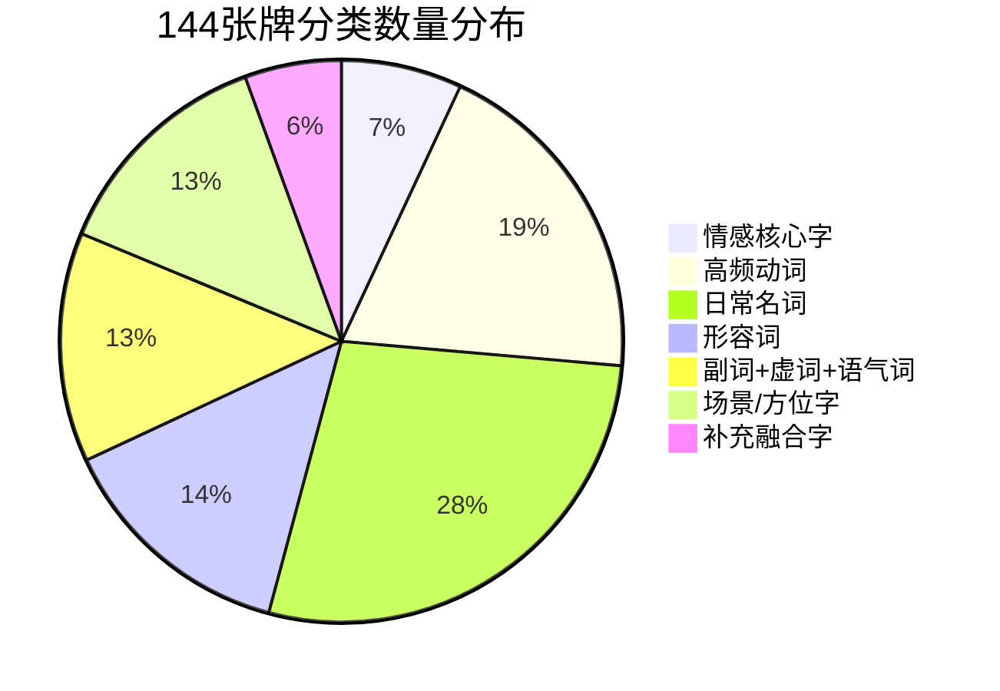
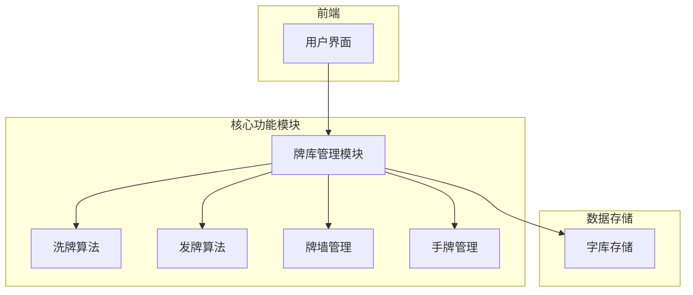
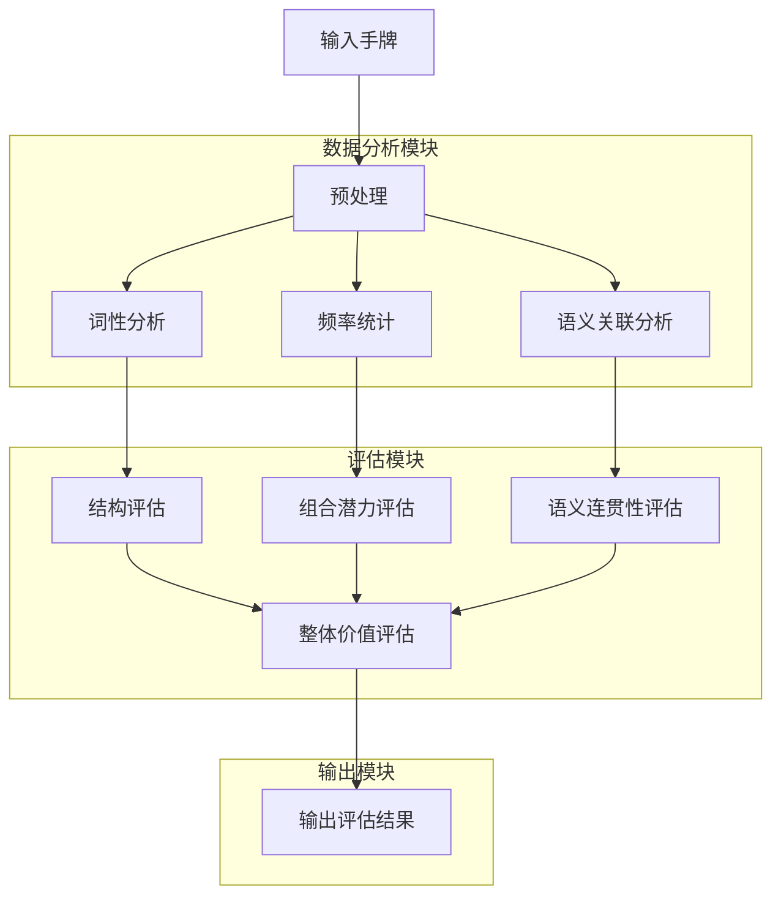

# 牌库设计方案文档

## 1. 牌库设计原则

牌库设计遵循以下核心原则：

### 1.1 高频字选择原则
- 全部选用现代汉语生活最高频汉字，无生僻字，适配全年龄段玩家
- 确保每个字都具有广泛的组词能力，能够适应各种造句场景

### 1.2 语义平衡原则
- 合理分配不同词性的汉字数量，确保造句时能够组成完整的句子结构
- 对人称、虚词、核心动词等造句刚需字增设重复牌，保证组词造句的流畅性

### 1.3 实用性原则
- 完整保留预设7大分类框架，总牌数精准控制为144张
- 玩家可自由替换、新增趣味字，仅需保持总牌数不变即可

### 1.4 易扩展性原则
- 设计支持自定义字库功能，允许玩家根据需求调整牌库内容
- 保持分类结构不变，确保游戏规则的一致性

## 2. 144张牌的详细分类和数量统计

### 2.1 分类总览

| 分类序号 | 分类名称 | 分类总牌数 | 占比 |
|---------|---------|-----------|------|
| 1       | 情感核心字 | 10张 | 6.94% |
| 2       | 高频动词 | 28张 | 19.44% |
| 3       | 日常名词 | 40张 | 27.78% |
| 4       | 形容词 | 20张 | 13.89% |
| 5       | 副词+虚词+语气词 | 19张 | 13.19% |
| 6       | 场景/方位字 | 19张 | 13.19% |
| 7       | 补充融合字 | 8张 | 5.56% |
| **总计** | **-** | **144张** | **100%** |

### 2.2 分类数量分布饼图



## 3. 每个分类的具体牌型

### 3.1 情感核心字（10张）

| 单字 | 数量 | 词性 | 主要用途 |
|------|------|------|----------|
| 我 | 2 | 人称代词 | 主语，表达第一人称 |
| 你 | 2 | 人称代词 | 主语/宾语，表达第二人称 |
| 爱 | 2 | 动词 | 核心情感动词 |
| 家 | 2 | 名词 | 表达家庭概念 |
| 心 | 2 | 名词 | 表达情感或心理活动 |

### 3.2 高频动词（28张）

| 单字 | 数量 | 词性 | 主要用途 |
|------|------|------|----------|
| 吃 | 2 | 动词 | 饮食类动作 |
| 喝 | 1 | 动词 | 饮食类动作 |
| 玩 | 1 | 动词 | 娱乐类动作 |
| 乐 | 1 | 动词/形容词 | 娱乐或情感表达 |
| 走 | 1 | 动词 | 移动类动作 |
| 跑 | 1 | 动词 | 快速移动类动作 |
| 看 | 1 | 动词 | 视觉类动作 |
| 听 | 1 | 动词 | 听觉类动作 |
| 说 | 2 | 动词 | 言语类动作 |
| 读 | 1 | 动词 | 阅读类动作 |
| 写 | 1 | 动词 | 书写类动作 |
| 做 | 1 | 动词 | 泛指动作 |
| 打 | 1 | 动词 | 打击类或工具操作动作 |
| 开 | 1 | 动词 | 开启类动作 |
| 关 | 1 | 动词 | 关闭类动作 |
| 拿 | 1 | 动词 | 取物类动作 |
| 放 | 1 | 动词 | 放置类动作 |
| 想 | 2 | 动词 | 心理活动类动作 |
| 念 | 1 | 动词 | 心理活动类动作 |
| 买 | 1 | 动词 | 交易类动作 |
| 卖 | 1 | 动词 | 交易类动作 |
| 学 | 1 | 动词 | 学习类动作 |
| 睡 | 1 | 动词 | 休息类动作 |
| 飞 | 1 | 动词 | 移动类动作（空中） |
| 洗 | 1 | 动词 | 清洁类动作 |

### 3.3 日常名词（40张）

| 单字 | 数量 | 词性 | 主要用途 |
|------|------|------|----------|
| 饭 | 1 | 名词 | 主食类 |
| 面 | 1 | 名词 | 主食类 |
| 水 | 1 | 名词 | 饮品类 |
| 茶 | 1 | 名词 | 饮品类 |
| 酒 | 1 | 名词 | 饮品类 |
| 菜 | 1 | 名词 | 蔬菜类 |
| 肉 | 1 | 名词 | 肉类 |
| 蛋 | 1 | 名词 | 蛋类 |
| 米 | 1 | 名词 | 主食类 |
| 车 | 1 | 名词 | 交通工具类 |
| 船 | 1 | 名词 | 交通工具类 |
| 机 | 1 | 名词 | 交通工具或设备类 |
| 路 | 1 | 名词 | 道路类 |
| 门 | 1 | 名词 | 建筑构件类 |
| 窗 | 1 | 名词 | 建筑构件类 |
| 床 | 1 | 名词 | 家具类 |
| 桌 | 1 | 名词 | 家具类 |
| 椅 | 1 | 名词 | 家具类 |
| 灯 | 1 | 名词 | 照明类 |
| 书 | 1 | 名词 | 学习用品类 |
| 笔 | 1 | 名词 | 学习用品类 |
| 纸 | 1 | 名词 | 学习用品类 |
| 钱 | 1 | 名词 | 货币类 |
| 包 | 1 | 名词 | 容器类 |
| 衣 | 1 | 名词 | 衣物类 |
| 鞋 | 1 | 名词 | 衣物类 |
| 猫 | 1 | 名词 | 动物类 |
| 狗 | 1 | 名词 | 动物类 |
| 花 | 1 | 名词 | 植物类 |
| 草 | 1 | 名词 | 植物类 |
| 树 | 1 | 名词 | 植物类 |
| 山 | 1 | 名词 | 自然景观类 |
| 海 | 1 | 名词 | 自然景观类 |
| 天 | 1 | 名词 | 自然景观类 |
| 日 | 1 | 名词 | 时间或自然类 |
| 月 | 1 | 名词 | 时间或自然类 |
| 风 | 1 | 名词 | 自然现象类 |
| 云 | 1 | 名词 | 自然现象类 |

### 3.4 形容词（20张）

| 单字 | 数量 | 词性 | 主要用途 |
|------|------|------|----------|
| 好 | 1 | 形容词 | 正面评价类 |
| 美 | 1 | 形容词 | 正面评价类 |
| 香 | 1 | 形容词 | 感官类（嗅觉） |
| 甜 | 1 | 形容词 | 感官类（味觉） |
| 快 | 1 | 形容词 | 速度类 |
| 慢 | 1 | 形容词 | 速度类 |
| 大 | 1 | 形容词 | 大小类 |
| 小 | 1 | 形容词 | 大小类 |
| 多 | 1 | 形容词 | 数量类 |
| 少 | 1 | 形容词 | 数量类 |
| 新 | 1 | 形容词 | 新旧类 |
| 旧 | 1 | 形容词 | 新旧类 |
| 暖 | 1 | 形容词 | 温度类 |
| 冷 | 1 | 形容词 | 温度类 |
| 喜 | 1 | 形容词 | 情感类 |
| 乐 | 1 | 形容词 | 情感类 |
| 安 | 1 | 形容词 | 状态类 |
| 康 | 1 | 形容词 | 状态类 |
| 顺 | 1 | 形容词 | 状态类 |
| 旺 | 1 | 形容词 | 状态类 |

### 3.5 副词+虚词+语气词（19张）

| 单字 | 数量 | 词性 | 主要用途 |
|------|------|------|----------|
| 的 | 2 | 助词 | 结构助词，用于修饰名词 |
| 地 | 1 | 助词 | 结构助词，用于修饰动词 |
| 得 | 1 | 助词 | 结构助词，用于补充说明动词 |
| 了 | 2 | 助词 | 时态助词，表示完成 |
| 着 | 1 | 助词 | 时态助词，表示进行中 |
| 过 | 1 | 助词 | 时态助词，表示过去 |
| 很 | 1 | 副词 | 程度副词 |
| 太 | 1 | 副词 | 程度副词 |
| 真 | 1 | 副词 | 程度副词 |
| 就 | 2 | 副词 | 时间或范围副词 |
| 也 | 2 | 副词 | 并列或递进副词 |
| 都 | 1 | 副词 | 范围副词 |
| 啊 | 1 | 语气词 | 感叹语气词 |
| 呀 | 1 | 语气词 | 感叹语气词 |
| 吧 | 1 | 语气词 | 疑问或建议语气词 |

### 3.6 场景/方位字（19张）

| 单字 | 数量 | 词性 | 主要用途 |
|------|------|------|----------|
| 校 | 1 | 名词 | 场景类（学校） |
| 店 | 1 | 名词 | 场景类（商店） |
| 园 | 1 | 名词 | 场景类（公园/花园） |
| 厨 | 1 | 名词 | 场景类（厨房） |
| 厅 | 1 | 名词 | 场景类（客厅/餐厅） |
| 房 | 1 | 名词 | 场景类（房间） |
| 里 | 1 | 方位词 | 方位类 |
| 外 | 1 | 方位词 | 方位类 |
| 上 | 1 | 方位词 | 方位类 |
| 下 | 1 | 方位词 | 方位类 |
| 左 | 1 | 方位词 | 方位类 |
| 右 | 1 | 方位词 | 方位类 |
| 前 | 1 | 方位词 | 方位类 |
| 后 | 1 | 方位词 | 方位类 |
| 东 | 1 | 方位词 | 方位类 |
| 南 | 1 | 方位词 | 方位类 |
| 西 | 1 | 方位词 | 方位类 |
| 北 | 1 | 方位词 | 方位类 |
| 家 | 1 | 名词 | 场景类（家庭） |

### 3.7 补充融合字（8张）

| 单字 | 数量 | 词性 | 主要用途 |
|------|------|------|----------|
| 一 | 2 | 数词 | 数量类 |
| 二 | 1 | 数词 | 数量类 |
| 三 | 1 | 数词 | 数量类 |
| 不 | 2 | 副词 | 否定副词 |
| 是 | 2 | 动词 | 判断动词 |

## 3. 重复牌的设计思路

### 3.1 重复牌设计的必要性

在传统麻将中，重复牌是为了增加组合的可能性，但在文字麻将中，重复牌的设计有其独特的考虑因素：

1. **造句流畅性**：某些字在句子中出现的频率极高，如“的”、“了”、“是”等，设置重复牌可以增加这些字的获取概率，提高造句的流畅性。

2. **关键结构字保障**：人称代词（如“我”、“你”）、核心动词（如“吃”、“说”、“想”）等是句子的核心骨架，设置重复牌可以确保玩家能够获取到这些关键字。

3. **组合多样性**：重复牌的存在可以增加句子的组合可能性，允许玩家创造更复杂、更丰富的句子。

### 3.2 重复牌设置原则

重复牌的设置遵循以下原则：

1. **高频使用原则**：仅对现代汉语中使用频率最高的字设置重复牌

2. **结构关键原则**：优先考虑对句子结构至关重要的字，如人称代词、结构助词、核心动词等

3. **语义平衡原则**：确保不同词性的重复牌数量相对平衡，避免某一类字过度重复

4. **实用性原则**：重复牌的设置以实际造句需要为依据，避免不必要的重复

### 3.3 重复牌具体设置

根据上述原则，我们对以下字设置了重复牌：

| 字 | 重复次数 | 分类 | 原因说明 |
|----|----------|------|----------|
| 我 | 2 | 情感核心字 | 第一人称代词，使用频率极高 |
| 你 | 2 | 情感核心字 | 第二人称代词，使用频率极高 |
| 爱 | 2 | 情感核心字 | 核心情感动词，使用频率高 |
| 家 | 2 | 情感核心字 | 家庭相关词汇，使用频率高 |
| 心 | 2 | 情感核心字 | 心理活动相关词汇，使用频率高 |
| 吃 | 2 | 高频动词 | 饮食类核心动词，使用频率极高 |
| 说 | 2 | 高频动词 | 言语类核心动词，使用频率极高 |
| 想 | 2 | 高频动词 | 心理活动核心动词，使用频率极高 |
| 的 | 2 | 副词+虚词+语气词 | 结构助词，使用频率最高 |
| 了 | 2 | 副词+虚词+语气词 | 时态助词，使用频率极高 |
| 就 | 2 | 副词+虚词+语气词 | 时间或范围副词，使用频率高 |
| 也 | 2 | 副词+虚词+语气词 | 并列或递进副词，使用频率高 |
| 一 | 2 | 补充融合字 | 数词，使用频率极高 |
| 不 | 2 | 补充融合字 | 否定副词，使用频率极高 |
| 是 | 2 | 补充融合字 | 判断动词，使用频率极高 |

## 4. 牌库管理系统的技术实现方案

### 4.1 技术架构



### 4.2 数据结构设计

#### 4.2.1 单字数据结构

```javascript
// 单字数据结构
interface WordCard {
  id: string; // 唯一标识符
  char: string; // 汉字
  category: string; // 分类
  pinyin: string; // 拼音（用于辅助识别）
  definition: string; // 基本释义（用于辅助造句）
  frequency: number; // 使用频率（1-5级，5级最高）
}

// 牌库分类
interface Category {
  id: string;
  name: string;
  totalCount: number;
  words: WordCard[];
}
```

#### 4.2.2 牌库数据结构

```javascript
// 完整牌库
interface CardLibrary {
  totalCount: number;
  categories: Category[];
  allCards: WordCard[];
}

// 当前游戏牌墙
interface CardWall {
  cards: WordCard[]; // 剩余牌
  discardPile: WordCard[]; // 已出牌
}

// 玩家手牌
interface PlayerHand {
  id: string;
  cards: WordCard[]; // 手牌
  exposedCards: WordCard[]; // 明放吃牌
}
```

### 4.3 核心功能实现

#### 4.3.1 牌库初始化

```javascript
// 牌库初始化函数
const initializeCardLibrary = (): CardLibrary => {
  // 1. 加载预设字库
  const wordDatabase = loadWordDatabase();
  
  // 2. 根据规则生成144张牌
  const library = generateCardLibrary(wordDatabase);
  
  // 3. 验证牌库完整性
  if (validateLibrary(library)) {
    return library;
  } else {
    throw new Error('牌库初始化失败，牌数或分类不符合规则');
  }
};

// 验证牌库完整性函数
const validateLibrary = (library: CardLibrary): boolean => {
  // 验证总牌数是否为144张
  if (library.totalCount !== 144) {
    return false;
  }
  
  // 验证各分类牌数是否符合要求
  const expectedCounts = {
    '情感核心字': 10,
    '高频动词': 28,
    '日常名词': 40,
    '形容词': 20,
    '副词+虚词+语气词': 19,
    '场景/方位字': 19,
    '补充融合字': 8
  };
  
  return library.categories.every(category => {
    const expectedCount = expectedCounts[category.name as keyof typeof expectedCounts];
    return expectedCount && category.totalCount === expectedCount;
  });
};
```

#### 4.3.2 洗牌算法

```javascript
// 洗牌算法实现
const shuffleCards = (cards: WordCard[]): WordCard[] => {
  // 使用Fisher-Yates洗牌算法
  const shuffledCards = [...cards];
  for (let i = shuffledCards.length - 1; i > 0; i--) {
    const j = Math.floor(Math.random() * (i + 1));
    [shuffledCards[i], shuffledCards[j]] = [shuffledCards[j], shuffledCards[i]];
  }
  
  return shuffledCards;
};

// 码牌算法（模拟传统麻将码牌方式）
const stackCards = (shuffledCards: WordCard[]): WordCard[] => {
  // 传统麻将码牌是每墩2张牌上下叠放
  // 我们可以通过调整顺序来模拟这种方式
  const stackedCards = [];
  for (let i = 0; i < shuffledCards.length; i += 2) {
    if (shuffledCards[i + 1]) {
      stackedCards.push(shuffledCards[i + 1]);
    }
    stackedCards.push(shuffledCards[i]);
  }
  
  return stackedCards;
};
```

#### 4.3.3 发牌算法

```javascript
// 发牌算法实现
const dealCards = (cardWall: WordCard[], playerCount: number): {[key: string]: WordCard[]} => {
  const hands: {[key: string]: WordCard[]} = {};
  
  // 1. 初始化玩家手牌
  for (let i = 0; i < playerCount; i++) {
    hands[`player${i}`] = [];
  }
  
  // 2. 按传统麻将规则发牌
  const players = Object.keys(hands);
  
  // 每人连续摸3轮，每轮4张牌
  for (let round = 0; round < 3; round++) {
    players.forEach(player => {
      hands[player] = [...hands[player], ...cardWall.splice(0, 4)];
    });
  }
  
  // 庄家跳牌摸2张，其余玩家各补摸1张
  hands[players[0]] = [...hands[players[0]], ...cardWall.splice(0, 2)];
  for (let i = 1; i < players.length; i++) {
    hands[players[i]] = [...hands[players[i]], ...cardWall.splice(0, 1)];
  }
  
  return hands;
};
```

#### 4.3.4 牌墙管理

```javascript
// 牌墙管理类
class CardWallManager {
  private cardWall: WordCard[];
  private discardPile: WordCard[];
  
  constructor(initialCards: WordCard[]) {
    this.cardWall = [...initialCards];
    this.discardPile = [];
  }
  
  // 摸牌
  drawCard(): WordCard | null {
    if (this.cardWall.length > 0) {
      return this.cardWall.shift() || null;
    }
    return null;
  }
  
  // 出牌到弃牌堆
  discardCard(card: WordCard): void {
    this.discardPile.push(card);
  }
  
  // 获取当前牌墙信息
  getCardWallInfo(): {
    remainingCount: number;
    discardCount: number;
    discardPile: WordCard[];
  } {
    return {
      remainingCount: this.cardWall.length,
      discardCount: this.discardPile.length,
      discardPile: [...this.discardPile]
    };
  }
  
  // 检查是否流局
  isGameOver(): boolean {
    return this.cardWall.length === 0;
  }
}
```

### 4.4 数据存储方案

#### 4.4.1 静态字库存储

字库数据可以存储在JSON文件中，便于维护和扩展：

```json
{
  "categories": [
    {
      "id": "1",
      "name": "情感核心字",
      "totalCount": 10,
      "words": [
        {"char": "我", "pinyin": "wǒ", "definition": "第一人称代词", "frequency": 5},
        {"char": "你", "pinyin": "nǐ", "definition": "第二人称代词", "frequency": 5},
        {"char": "爱", "pinyin": "ài", "definition": "喜欢、热爱", "frequency": 5},
        {"char": "家", "pinyin": "jiā", "definition": "家庭、住所", "frequency": 5},
        {"char": "心", "pinyin": "xīn", "definition": "心脏、心理", "frequency": 5}
      ]
    },
    // 其他分类...
  ]
}
```

#### 4.4.2 游戏状态存储

游戏状态可以使用localStorage或IndexedDB进行存储：

```javascript
// 游戏状态存储
class GameStateStorage {
  static saveGameState(gameState: any): void {
    localStorage.setItem('wordMahjongGameState', JSON.stringify(gameState));
  }
  
  static loadGameState(): any | null {
    const savedState = localStorage.getItem('wordMahjongGameState');
    return savedState ? JSON.parse(savedState) : null;
  }
  
  static clearGameState(): void {
    localStorage.removeItem('wordMahjongGameState');
  }
}
```

## 5. 洗牌和发牌算法

### 5.1 洗牌算法

#### 5.1.1 Fisher-Yates洗牌算法

Fisher-Yates洗牌算法是一种高效的随机排列算法，时间复杂度为O(n)，空间复杂度为O(1)。该算法的核心思想是：

1. 从最后一个元素开始，向前遍历数组
2. 对于每个元素，随机选择一个小于当前索引的元素
3. 交换这两个元素的位置

```javascript
// Fisher-Yates洗牌算法实现
const fisherYatesShuffle = (array: any[]): any[] => {
  const shuffledArray = [...array];
  for (let i = shuffledArray.length - 1; i > 0; i--) {
    const j = Math.floor(Math.random() * (i + 1));
    [shuffledArray[i], shuffledArray[j]] = [shuffledArray[j], shuffledArray[i]];
  }
  return shuffledArray;
};
```

#### 5.1.2 模拟传统麻将码牌

在传统麻将中，牌是上下叠放的，我们可以通过调整洗牌后的顺序来模拟这种码牌方式：

```javascript
// 模拟传统麻将码牌
const stackCardsForMahjong = (shuffledCards: any[]): any[] => {
  const stackedCards = [];
  for (let i = 0; i < shuffledCards.length; i += 2) {
    if (shuffledCards[i + 1]) {
      stackedCards.push(shuffledCards[i + 1]);
    }
    stackedCards.push(shuffledCards[i]);
  }
  return stackedCards;
};
```

### 5.2 发牌算法

#### 5.2.1 传统麻将发牌规则

传统麻将的发牌规则如下：

1. 4人分坐东、南、西、北四个方位
2. 每人连续摸3轮，每轮4张牌（共12张）
3. 庄家跳牌摸2张，其余闲家各补摸1张（最终庄家14张，闲家13张）

```javascript
// 麻将发牌算法
const dealMahjongCards = (cardWall: any[], playerCount: number): {[key: string]: any[]} => {
  const hands: {[key: string]: any[]} = {};
  
  // 初始化玩家手牌
  for (let i = 0; i < playerCount; i++) {
    hands[`player${i}`] = [];
  }
  
  const players = Object.keys(hands);
  
  // 每人连续摸3轮，每轮4张牌
  for (let round = 0; round < 3; round++) {
    players.forEach(player => {
      hands[player] = [...hands[player], ...cardWall.splice(0, 4)];
    });
  }
  
  // 庄家跳牌摸2张，其余玩家各补摸1张
  hands[players[0]] = [...hands[players[0]], ...cardWall.splice(0, 2)];
  for (let i = 1; i < players.length; i++) {
    hands[players[i]] = [...hands[players[i]], ...cardWall.splice(0, 1)];
  }
  
  return hands;
};
```

#### 5.2.2 开牌位置确定

传统麻将中，开牌位置由庄家掷骰子的总点数决定：

```javascript
// 确定开牌位置
const determineStartPosition = (dice1: number, dice2: number, wallCount: number): number => {
  const total = dice1 + dice2;
  // 按顺时针方向数对应墩数
  const startIndex = (total - 1) * 2;
  return startIndex % wallCount;
};
```

### 5.3 算法优化策略

#### 5.3.1 随机性优化

为了确保洗牌的随机性，我们可以：

1. 使用高质量的随机数生成器
2. 在洗牌过程中多次洗牌
3. 对洗牌结果进行验证

```javascript
// 优化后的洗牌方法
const optimizedShuffle = (array: any[]): any[] => {
  const shuffleCount = 3; // 洗牌次数
  let shuffledArray = [...array];
  
  for (let i = 0; i < shuffleCount; i++) {
    shuffledArray = fisherYatesShuffle(shuffledArray);
  }
  
  return shuffledArray;
};
```

#### 5.3.2 性能优化

对于大型牌库的洗牌和发牌，我们可以：

1. 使用高效的数据结构
2. 避免不必要的数组复制
3. 优化发牌逻辑

```javascript
// 性能优化的发牌方法
const efficientDealCards = (cardWall: any[], playerCount: number): {[key: string]: any[]} => {
  const hands: {[key: string]: any[]} = {};
  
  for (let i = 0; i < playerCount; i++) {
    hands[`player${i}`] = [];
  }
  
  const players = Object.keys(hands);
  
  // 优化连续摸牌逻辑
  let cardIndex = 0;
  for (let round = 0; round < 3; round++) {
    players.forEach(player => {
      hands[player].push(
        cardWall[cardIndex++],
        cardWall[cardIndex++],
        cardWall[cardIndex++],
        cardWall[cardIndex++]
      );
    });
  }
  
  // 庄家跳牌摸2张
  hands[players[0]].push(
    cardWall[cardIndex++],
    cardWall[cardIndex++]
  );
  
  // 闲家各补摸1张
  for (let i = 1; i < players.length; i++) {
    hands[players[i]].push(cardWall[cardIndex++]);
  }
  
  // 从牌墙中移除已发的牌
  cardWall.splice(0, cardIndex);
  
  return hands;
};
```

## 6. 牌型分析和价值评估系统

### 6.1 系统架构



### 6.2 核心功能实现

#### 6.2.1 手牌预处理

```javascript
// 手牌预处理
const preprocessHand = (cards: WordCard[]): WordCard[] => {
  // 1. 去除重复牌（在文字麻将中，重复牌是允许的）
  // 2. 按词性分类整理
  const processedCards = cards.sort((a, b) => {
    const categoryOrder = [
      '情感核心字', '高频动词', '日常名词',
      '形容词', '副词+虚词+语气词', '场景/方位字', '补充融合字'
    ];
    return categoryOrder.indexOf(a.category) - categoryOrder.indexOf(b.category);
  });
  
  return processedCards;
};
```

#### 6.2.2 词性分析

```javascript
// 词性分析
const analyzePartOfSpeech = (cards: WordCard[]): {[key: string]: WordCard[]} => {
  const posAnalysis: {[key: string]: WordCard[]} = {
    nouns: [],
    verbs: [],
    adjectives: [],
    adverbs: [],
    pronouns: [],
    particles: [],
    numerals: [],
    other: []
  };
  
  // 根据分类判断词性
  const categoryToPos = {
    '情感核心字': 'pronouns',
    '高频动词': 'verbs',
    '日常名词': 'nouns',
    '形容词': 'adjectives',
    '副词+虚词+语气词': 'particles',
    '场景/方位字': 'nouns',
    '补充融合字': 'numerals'
  };
  
  cards.forEach(card => {
    const pos = categoryToPos[card.category as keyof typeof categoryToPos] || 'other';
    posAnalysis[pos].push(card);
  });
  
  return posAnalysis;
};
```

#### 6.2.3 结构评估

```javascript
// 句子结构评估
const evaluateSentenceStructure = (posAnalysis: {[key: string]: WordCard[]}): number => {
  // 基本结构：主语 + 谓语 + 宾语
  // 评估各个成分的完整性
  
  let score = 0;
  
  // 主语（人称代词）
  if (posAnalysis.pronouns.length > 0) {
    score += 20;
  }
  
  // 谓语（动词）
  if (posAnalysis.verbs.length > 0) {
    score += 30;
  }
  
  // 宾语（名词）
  if (posAnalysis.nouns.length > 0) {
    score += 20;
  }
  
  // 修饰成分（形容词、副词）
  if (posAnalysis.adjectives.length > 0 || posAnalysis.adverbs.length > 0) {
    score += 15;
  }
  
  // 结构助词（的、地、得）
  if (posAnalysis.particles.some(card => ['的', '地', '得'].includes(card.char))) {
    score += 10;
  }
  
  // 语气词（啊、呀、吧）
  if (posAnalysis.particles.some(card => ['啊', '呀', '吧'].includes(card.char))) {
    score += 5;
  }
  
  return Math.min(100, score);
};
```

#### 6.2.4 组合潜力评估

```javascript
// 组合潜力评估
const evaluateCombinationPotential = (cards: WordCard[]): number => {
  const highFrequencyWords = cards.filter(card => card.frequency >= 4);
  const coreWords = cards.filter(card => ['我', '你', '爱', '家', '心', '吃', '说', '想'].includes(card.char));
  
  let score = 0;
  
  // 高频词占比
  score += Math.min(30, (highFrequencyWords.length / cards.length) * 30);
  
  // 核心词数量
  score += Math.min(30, coreWords.length * 5);
  
  // 虚词数量（提升组合灵活性）
  const functionWords = cards.filter(card => ['的', '了', '就', '也'].includes(card.char));
  score += Math.min(25, functionWords.length * 5);
  
  // 词性多样性
  const uniqueCategories = new Set(cards.map(card => card.category));
  score += Math.min(15, uniqueCategories.size * 2);
  
  return Math.min(100, score);
};
```

#### 6.2.5 语义连贯性评估

```javascript
// 语义连贯性评估
const evaluateSemanticCoherence = (cards: WordCard[]): number => {
  // 简单的语义连贯性评估
  // 实际应用中可以使用NLP技术进行更复杂的评估
  
  const wordList = cards.map(card => card.char);
  
  // 常用搭配检查
  const commonCollocations = [
    '我爱', '你爱', '家爱', '爱心', '吃饭', '喝水', '玩耍', '看书',
    '听音乐', '说话', '写字', '做饭', '开门', '关门', '拿钱', '放东西',
    '想家', '想念', '买东西', '卖东西', '学习', '睡觉', '飞行', '洗澡'
  ];
  
  let score = 0;
  
  // 检查常用搭配
  commonCollocations.forEach(collocation => {
    const hasCollocation = collocation.split('').every(char => 
      wordList.includes(char)
    );
    
    if (hasCollocation) {
      score += 10;
    }
  });
  
  return Math.min(100, score);
};
```

#### 6.2.6 整体价值评估

```javascript
// 整体价值评估
const evaluateOverallValue = (cards: WordCard[]): {
  score: number;
  structureScore: number;
  combinationScore: number;
  semanticScore: number;
  recommendations: string[];
} => {
  // 预处理手牌
  const processedCards = preprocessHand(cards);
  
  // 词性分析
  const posAnalysis = analyzePartOfSpeech(processedCards);
  
  // 结构评估
  const structureScore = evaluateSentenceStructure(posAnalysis);
  
  // 组合潜力评估
  const combinationScore = evaluateCombinationPotential(processedCards);
  
  // 语义连贯性评估
  const semanticScore = evaluateSemanticCoherence(processedCards);
  
  // 计算总分
  const overallScore = Math.round(
    structureScore * 0.4 + 
    combinationScore * 0.3 + 
    semanticScore * 0.3
  );
  
  // 生成建议
  const recommendations = generateRecommendations(posAnalysis);
  
  return {
    score: overallScore,
    structureScore,
    combinationScore,
    semanticScore,
    recommendations
  };
};

// 生成建议
const generateRecommendations = (posAnalysis: {[key: string]: WordCard[]}): string[] => {
  const recommendations = [];
  
  if (posAnalysis.pronouns.length === 0) {
    recommendations.push('建议保留或获取人称代词（如"我"、"你"）以构成句子主语');
  }
  
  if (posAnalysis.verbs.length === 0) {
    recommendations.push('建议保留或获取动词（如"吃"、"说"、"想"）以构成句子谓语');
  }
  
  if (posAnalysis.nouns.length === 0) {
    recommendations.push('建议保留或获取名词（如"饭"、"书"、"家"）以构成句子宾语');
  }
  
  if (!posAnalysis.particles.some(card => ['的', '了', '就', '也'].includes(card.char))) {
    recommendations.push('建议保留或获取虚词（如"的"、"了"）以提升句子的流畅性');
  }
  
  return recommendations;
};
```

### 6.3 评估结果展示

```javascript
// 展示评估结果
const displayEvaluationResult = (evaluation: {
  score: number;
  structureScore: number;
  combinationScore: number;
  semanticScore: number;
  recommendations: string[];
}): void => {
  console.log(`手牌总价值：${evaluation.score}/100分`);
  console.log(`结构完整性：${evaluation.structureScore}/100分`);
  console.log(`组合潜力：${evaluation.combinationScore}/100分`);
  console.log(`语义连贯性：${evaluation.semanticScore}/100分`);
  
  if (evaluation.recommendations.length > 0) {
    console.log('\n优化建议：');
    evaluation.recommendations.forEach((recommendation, index) => {
      console.log(`${index + 1}. ${recommendation}`);
    });
  }
};
```

## 7. 总结

### 7.1 牌库设计特点

1. **语义导向设计**：基于现代汉语高频字和语义完整性原则，确保玩家能够组成通顺的句子
2. **实用性优先**：全部选用日常高频字，无生僻字，上手门槛低
3. **结构平衡**：合理分配不同词性的汉字数量，确保句子结构的完整性
4. **扩展性设计**：支持自定义字库和分类，允许玩家根据需要调整牌库内容

### 7.2 技术实现特点

1. **模块化架构**：将牌库管理、洗牌、发牌、评估等功能模块化，便于维护和扩展
2. **算法优化**：使用高效的洗牌和发牌算法，确保游戏的公平性和随机性
3. **数据驱动**：基于详细的字库数据，实现智能的牌型分析和价值评估
4. **用户友好**：提供直观的评估结果和优化建议，帮助玩家提升游戏水平

### 7.3 应用前景

这套牌库设计方案适用于各种文字麻将游戏场景，从线下实体游戏到在线电子游戏都能很好地支持。其简单的规则和智能化的评估系统，使得游戏既适合休闲娱乐，也适合作为语文学习工具，具有广阔的应用前景。

未来，可以通过引入更先进的NLP技术，进一步提升牌型分析和价值评估的准确性，为玩家提供更精准的建议。同时，可以根据用户反馈持续优化字库设计，提升游戏的趣味性和挑战性。